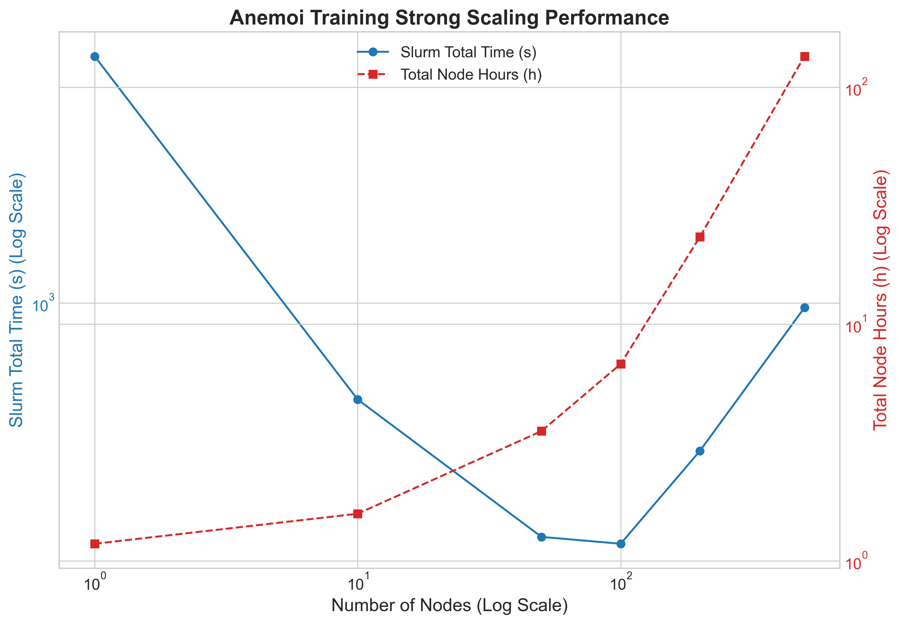

# Scaling Anemoi Training and Fine-Tuning on Isambard-AI

## Introduction

## Setup

### Initial Scaling Tests

We start with baseline experiments to understand how Anemoi scales with different node counts on Isambard-AI. We chose the `O96` setup for these tests, with the results depicted in the following graph. We pretrained the Anemoi model for 2 epochs varying node counts 1, 10, 50, 100, 200, and 500.

We measured both the wall-clock time (`Slurm Total Time`) and the total computational cost (`Total Node Hours`) against an increasing number of nodes and plotted them on a log-log scale to capture the strong scaling behaviour in the graph below.

Observations:

- The results in the graph reveal a pattern of initial performance gains followed by diminishing returns and eventual performance degradation due to overheads. While the wall-clock time provides a measure of speed, the `Total Node Hours` offers critical insight into the efficiency and overall cost of the computation. This metric, representing the product of the number of nodes and the job duration, shows a continuous upward trend across the entire experiment.

- Scaling from a single node to 100 nodes yields a significant reduction in total time, demonstrating the effectiveness of parallelisation in this range. However, beyond this 100-node peak, the trend reverses, and the `Slurm Total Time` begins to increase. This indicates that the time spent on inter-node communication, data synchronization, and other parallel overheads starts to outweigh the benefits of additional computational power.

- Even in the range where the wall-clock time is decreasing (1 to 100 nodes), the total node hours increase, signifying that each incremental speedup comes at a higher total computational cost. After the 100-node mark, this inefficiency becomes particularly pronounced, with the `Total Node Hours` rising sharply. This confirms that the additional nodes are contributing more to system overhead than to useful work, making any scaling beyond 100 nodes not only slower but also substantially more resource-intensive and cost-ineffective.