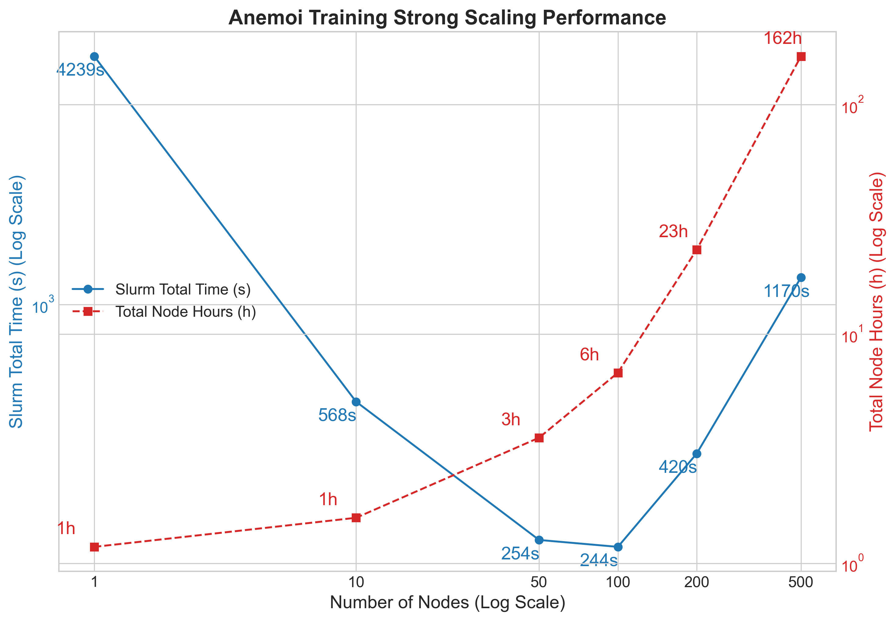
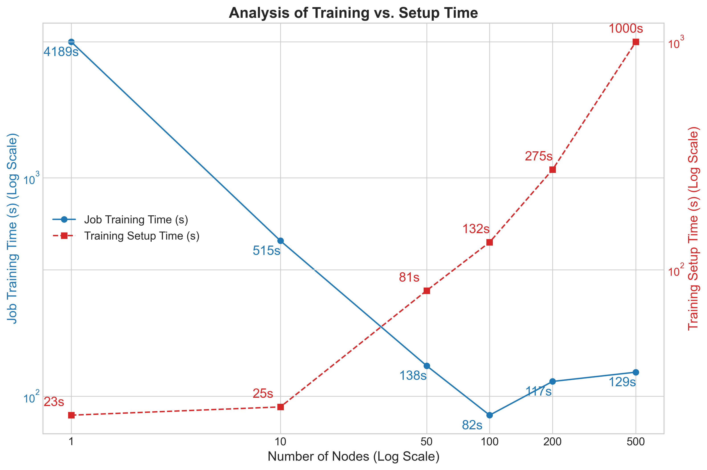
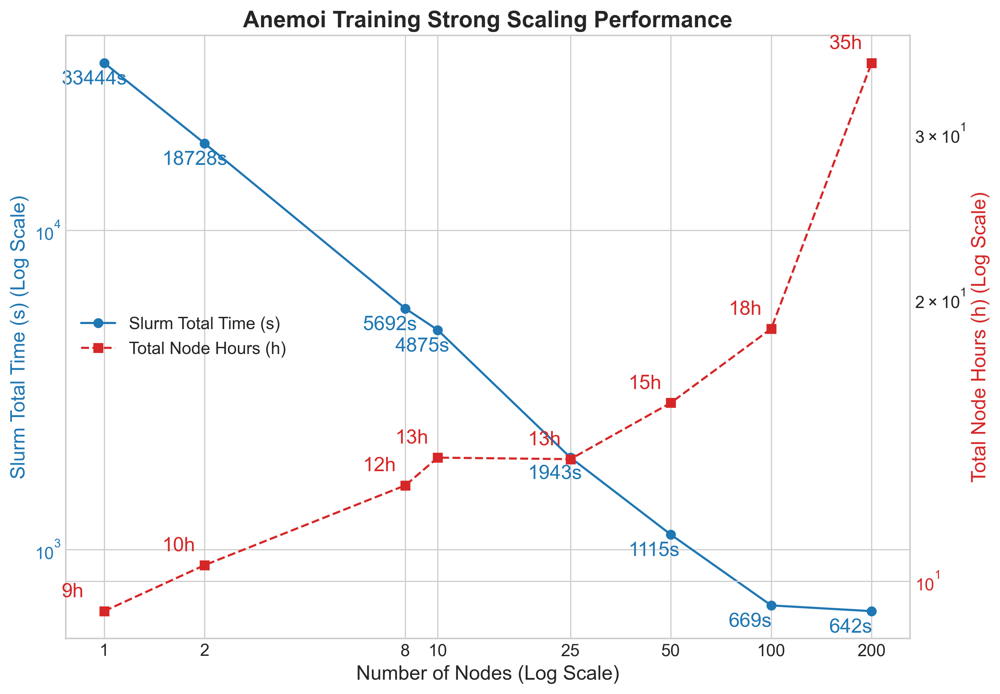
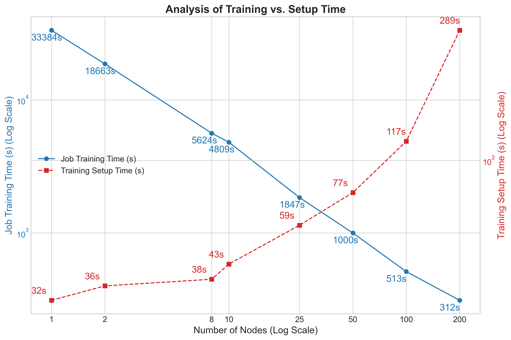

# Scaling Anemoi Training and Fine-Tuning on Isambard-AI

## Introduction

## Setup

### Initial Scaling Tests

#### O96 Strong Scaling

We start with baseline experiments to understand how Anemoi scales with different node counts on Isambard-AI. We chose the `O96` setup for these tests, with the results depicted in the following graph. We pretrained the Anemoi model for 2 epochs varying node counts 1, 10, 50, 100, 200, and 500.

We measured both the wall-clock time (`Slurm Total Time`) and the total computational cost (`Total Node Hours`) against an increasing number of nodes and plotted them on a log-log scale to capture the strong scaling behaviour in the graph below.



Observations:

- The results in the graph reveal a pattern of initial performance gains followed by diminishing returns and eventual performance degradation due to overheads. While the wall-clock time provides a measure of speed, the `Total Node Hours` offers critical insight into the efficiency and overall cost of the computation. This metric, representing the product of the number of nodes and the job duration, shows a continuous upward trend across the entire experiment.

- Scaling from a single node to 100 nodes yields a significant reduction in total time, demonstrating the effectiveness of parallelisation in this range. However, beyond this 100-node peak, the trend reverses, and the `Slurm Total Time` begins to increase. This indicates that the time spent on inter-node communication, data synchronization, and other parallel overheads starts to outweigh the benefits of additional computational power.

- Even in the range where the wall-clock time is decreasing (1 to 100 nodes), the total node hours increase, signifying that each incremental speedup comes at a higher total computational cost. After the 100-node mark, this inefficiency becomes particularly pronounced, with the `Total Node Hours` rising sharply. This confirms that the additional nodes are contributing more to system overhead than to useful work, making any scaling beyond 100 nodes not only slower but also substantially more resource-intensive and cost-ineffective.

In addition to the strong scaling analysis, we also looked into the total job time breakdown, by separating the actual training time from the setup time. The following plot illustrates this breakdown:



Observations:

- The data reveals a clear trade-off between parallelising the workload and the overhead required to manage it. As the number of nodes increases from 1 to 100, the Job Training Time (blue line) drops significantly, from 4,189 seconds to a minimum of 82 seconds, demonstrating effective strong scaling.

- In contrast, the Training Setup Time (red line) exhibits a continuous and dramatic increase with each addition of nodes, starting at just 23 seconds and ballooning to 1000 seconds on 500 nodes. This opposing trend highlights that while distributing the training task speeds up computation, the initialisation phase becomes progressively more burdensome.

- The scaling efficiency fundamentally breaks down beyond the 100-node mark. At 200 nodes, the Training Setup Time (275s) is already more than double the Job Training Time (117s), indicating that the system spends far more time preparing for the job than actually executing it. This inefficiency culminates at the 500-node test, where the setup time is nearly eight times longer than the training time. This crossover point demonstrates a critical bottleneck in the workflow, where the cost of coordinating a large number of nodes completely negates the computational benefits, leading to a net loss in overall performance.

#### n320 Strong Scaling

Following the baseline tests with the `O96` dataset, we repeated the strong scaling experiments using the significantly higher resolution `n320` dataset. The `n320` configuration represents a much heavier computational workload per grid point, which theoretically allows for better parallelisation efficiency as there is more "useful work" to perform on each GPU relative to the communication overhead required between steps.

For these experiments, we trained the model for 2 epochs across a node range of 1, 2, 8, 10, 25, 50, 100, and 200 nodes. We haven't yet tested beyond 200 nodes for the `n320` setup due to resource constraints and the already observed trends from the `O96` tests. As with the previous tests, we tracked both the wall-clock time to assess speedup and the total node hours to evaluate the computational cost efficiency.



Observations:

- Improved Scaling Range: Compared to the `O96` experiments, the `n320` workload scales effectively over a wider range of resources. The Slurm Total Time decreases near-linearly from 33,444 seconds (~9.3 hours) on a single node down to 669 seconds on 100 nodes. This indicates that the heavier computational load of the `n320` dataset more effectively utilises the available GPU compute power up to this point.

- Diminishing Returns at 200 Nodes: The transition from 100 to 200 nodes yields a negligible reduction in wall-clock time (669s to 642s), suggesting a hard scalability limit has been reached. However, the cost penalty is severe: the Total Node Hours nearly doubles from 18.58 hours to 35.67 hours. This confirms that while 100 nodes offer a fast and relatively efficient runtime, pushing to 200 nodes provides almost no speed benefit while drastically increasing resource consumption.
- Cost Stability: Unlike the lighter `O96` workload, where cost increased immediately, the `n320` setup maintains relatively stable cost efficiency up to 25 nodes (rising only from 9.29h to 13.49h). This suggests the system is well-optimized for this resolution at low-to-medium cluster sizes.

To better understand the plateau observed at 200 nodes, we again decomposed the total job time into actual training time versus setup time.



Observations:

- Heavier Workload Masks Overhead: The Job Training Time (blue line) reduces smoothly from 33,384 seconds on 1 node to 312 seconds on 200 nodes. Because the `n320` model requires more computation per step than `O96`, the training phase remains dominant over the setup phase for much longer.
- Convergence at 200 Nodes: While the Training Setup Time (red line) increases exponentially with node count—rising from 32s to 289s, it does not completely overtake the training time as seen in the `O96` tests. At 200 nodes, the training time (312s) and setup time (289s) are nearly roughly equal.
- The Overhead Bottleneck: Although setup time has not eclipsed training time, it has become a significant fraction of the total job duration at 200 nodes (accounting for nearly 50% of the active job time). This explains the plateau in the previous scaling plot: even though the GPUs are calculating gradients faster, the time spent initialising the distributed environment prevents any meaningful reduction in total wall-clock time.

### Initial bottle neck investigation

## Profiling Anemoi Training

To gain deeper insights into the performance bottlenecks observed during the scaling tests, we coducted a series of profiling experiments. These profiles aimed to dissect the training process, identifying which components contributed most to the overall execution time and how these contributions changed with varying node counts.

### Simple Profiling

We began with a straightforward profiling approach, by utilising anemoi's built-in profiling capabilities and a `simple` profiling configuration which reports high-level benchmarking and timing information. We ran these profiles on the `O96` dataset across a range of node counts: 1, 10, 50, with each run training for 1000, 100, and 20 steps respectively to keep the total training amount of work roughly consistent between tests.

| Metric | 1 Node (1000 steps) | 10 Nodes (100 steps) | 50 Nodes (20 steps) | Comment |
| :--- | :--- | :--- | :--- | :--- |
| **Avg Batch Time** (s) | 1.01 | 1.23 | 1.58 | ❌ **Increasing** |
| **Forward Pass** (`training_step`) (s) | 0.27 | 0.35 | 0.48 | ❌ **Increasing** |
| **Backward Pass** (`backward`) (s) | 0.73 | 0.77 | 0.78 | ✅ No Bottleneck |
| **Training Throughput** (batches/s) | 0.97 | 0.76 | 0.54 | ❌ **Decreasing** |
| **Data Loading Throughput** | 780 | 301 | 7,891 | ✅ No Bottleneck |
| **Validation Throughput** | 1.47 | 1.95 | 4.65 | ✅ No Bottleneck |

Observations:

- The most critical observation is that training speed decreases as node count increases. Instead of speeding up, the system takes longer to process a single batch as you scale from 1 to 50 nodes (1.01s to 1.58s).

This indicates network communication overhead. The cost of synchronising gradients (All-Reduce) and managing the distributed group strategy outweighs the compute power added by the extra nodes.

The `optimizer_step` accounts for nearly 100% of the batch time in all configurations, suggesting the system is blocking while waiting for gradient synchronisation across the distributed workers.

- While the Backward pass (`backward`) times remained relatively stable (0.73s to 0.78s), the Forward pass (`training_step`) degraded significantly, taking nearly twice as long on 50 nodes (0.48s) compared to 1 node (0.27s).

This suggests that the distributed strategy (DDPGroupStrategy) introduces significant overhead even during the forward pass, likely due to broadcast operations or synchronisation barriers required before computation can begin.

- The Data Loading Throughput is consistently orders of magnitude higher than the training throughput (e.g., 7,891 vs 0.54 on 50 nodes). The model is compute/network bound, not I/O bound.

- Unlike training, validation throughput increases with node count (1.46 to 4.65). This is somewhat expected behaviour, as validation typically requires less frequent communication (synchronisation often happens only at the end of the epoch), allowing the system to utilise the parallel compute of 50 nodes effectively for inference.

### NCCL Benchmarking

To further investigate the communication overheads identified in the profiling step, we conducted NCCL benchmarking tests using the NCCL tests suite. These benchmarks help us understand the performance characteristics of the underlying communication library (NCCL) used for synchronising gradients across multiple GPUs in a distributed training setup.

The NCCL `All-Reduce` test is a synthetic benchmark designed to measure the raw communication speed of the All-Reduce operation, which is the critical synchronisation step used in distributed deep learning to average gradients across all GPUs. By performing this specific collective operation repeatedly on dummy data, the test isolates the performance of the physical interconnects, such as NVLink for intra-node communication and Slingshot or InfiniBand for inter-node traffic, stripping away any overhead from the deep learning framework (like PyTorch) or data loading pipelines. This makes it the definitive diagnostic tool for determining whether training bottlenecks are caused by physical network limitations (infrastructure) or software inefficiencies, as it provides a clear "speed limit" (Bus Bandwidth) that the hardware can support.

We have carried out the NCCL All-Reduce benchmarks on Isambard-AI across varying node counts: 1, 10, 50, and 200 nodes. Each test was executed using the `job_nccl_test.sh` script, which submits the benchmark job to the Slurm scheduler with the specified number of nodes.

| Nodes | Total GPUs | Peak Bus Bandwidth (GB/s) | Scaling Efficiency |
| :--- | :--- | :--- | :--- |
| **1** | 4 | **342.5** | Baseline (NVLink) |
| **10** | 40 | **92.7** | Excellent (Slingshot) |
| **50** | 200 | **91.2** | Excellent (Slingshot) |
| **200** | 800 | **70.8** | Good (~23% drop) |

Key observation: network is not the bottleneck: The bandwidth remains stable between 10 nodes (92.7 GB/s) and 50 nodes (91.2 GB/s). This suggests that the "negative scaling" seen in the training runs is **not** caused by network congestion or hardware limits.

### Detailed Profiling

Let's start with 1 gpu to get a baseline of what is happening during training. We run with the `detailed` profiling configuration. Let's look at the memory summary first:

```
Input size (MB): 126.44
Forward/backward pass size (MB): 95124.44
Params size (MB): 462.27
Estimated Total Size (MB): 95713.15
```

The model weights are only 462 MB, while the forward/backward pass uses 95 GB of memory. This indicates that the model is quite large and requires significant memory for activations during training. This means that for every 1 byte of model parameters, we are using approximately 205 bytes of memory for activations during the forward and backward passes. 

```
Total params: 231,222,552
Trainable params: 231,222,552
Non-trainable params: 0
Total mult-adds (Units.TERABYTES): 23.42
```

The model summary shows 23.42 Tera-operations (Mult-Adds) per pass. For a 231M parameter model, this is an extremely high ratio of compute-to-parameters, caused by the large number of nodes (40,320) and the Graph Transformer's edge-based operations.

With the Average Step Time of ~1.23s, this gives us a compute throughput of approximately 18.7 TFLOPS, whereas the advertised performance of GH200 if using Tensor Cores is FP32 989 TFLOPS per GPU and if not using Tensor cores FP32 67 TFLOPS. 

https://www.nvidia.com/en-gb/data-center/h100/

Either way, we are significantly below the theoretical peak performance of the hardware.

However, the TensorBoard trace shows that the GPU utilisation is very high:

```
GPU Utilization (from GPU Summary): 92.93%
SM Efficiency (from GPU Summary): 90.93%
```

Since the GPU is performing at 18.05 TFLOPS with over 90% utilisation, however the theoretical peak is much higher, this suggests that the model is **memory bandwidth bound**.

Another important measure is the Achieved Occupancy:

```
Est. Achieved Occupancy 41.93 %
```

#### Action 1: Activation Checkpointing

This indicates that the GPU is only able to keep 41.93% of its compute units busy at any given time, which is low and supports the hypothesis that the model is memory bandwidth bound.

To address this we have tried adjusting the `num_chunks` parameter in the `processor` configuration. In the Anemoi architecture, the `num_chunks` parameter is the primary mechanism for `Activation Checkpointing`. It works by dividing the number of layers of the `TransformerProcessor` into a specified number of segments, and then for each segment, the model discards intermediate activations during the forward pass to save GPU memory and re-calculates them "on the fly" during the backward pass. Setting num_chunks: 16 means the model checkpoints every single layer (maximum memory saving, maximum compute penalty), while num_chunks: 1 disables checkpointing entirely (maximum memory usage, minimum compute penalty).

This setting did not change the throughput as the model is Memory-Bandwidth Bound, not compute-bound, and the bottleneck is located in the Mapper layers, not the Processor. According to the model summary, the Encoder and Decoder (Mappers) are performing massive linear operations on 322,560 and 87,552 nodes respectively, which accounts for the vast majority of the 23.4 Tera-ops per pass.

#### Action 2: Model compilation and Triton

Model compilation via `torch.compile` is an optimisation process that transforms standard PyTorch code into high-performance machine code specifically tuned for the target hardware, in this case, NVIDIA's Grace Hopper GPUs. It works by capturing the model’s computational graph and applying "kernel fusion," a technique that merges multiple sequential operations, such as a Linear layer followed by a GELU activation and a LayerNorm, into a single execution step. 

This optimisation is powered by **Triton**, a domain-specific compiler and language that allows `torch.compile` to generate highly efficient CUDA kernels directly from Python. By using Triton, the model can keep intermediate data within the GPU's fast on-chip SRAM or L2 cache instead of constantly writing and reading activations from the 120GB HBM3 main memory. 

In our case, for a memory-bandwidth bound model like Anemoi, this significantly reduces the traffic on the memory bus, which is often the primary bottleneck on the Grace Hopper architecture.

| Metric | Without Compile | With Compile | Difference |
| :--- | :--- | :--- | :--- |
| **Average Step Time** | 1,297,112 us (**1.297s**) | 1,171,395 us (**1.171s**) | **~10% Faster** |
| **Kernel Time** | 1,204,099 us | 1,087,890 us | **~10% reduction** |
| **SM Efficiency** | 90.75% | 91.58% | Slightly Better |
| **Achieved Occupancy** | **41.86%** | **37.0%** | **-11.7% Lower** |
| **Realized TFLOPS** | 18.05 TFLOPS | **20.00 TFLOPS** | **+11% Increase** |

Observations:

- The profiling results demonstrate the tangible benefits, showing a 10% improvement in total step time (reducing from 1.29s to 1.17s) and an increase in realised math performance to 20 TFLOPS.
- The resulsts also show a drop in Achieved Occupancy (from 41.8% to 37.0%) alongside the speed increase. This confirms that Triton successfully fused multiple kernels; these fused kernels use more registers per thread to keep data on-chip, which limits the number of active threads but completes the overall batch faster by minimising memory-stalls. While the massive matrix multiplications in the model's mapper layers remain limited by the physical bandwidth of the HBM3 memory, the compilation of the Graph Transformer processor effectively bypassed the "memory wall" for the rest of the architecture, resulting in a more efficient utilisation of the Hopper core.

#### Action 3: FP8

The performance comparison between `FP8` and `FP16-mixed` precision was conducted on a single NVIDIA GH200 GPU over 100 training steps to evaluate steady-state throughput. The FP8 test utilised the NVIDIA Transformer Engine to leverage the Hopper architecture’s specialized 8-bit Tensor Cores, which theoretically offers double the mathematical throughput and half the memory traffic compared to 16-bit formats. 

| Metric | FP16 Mixed | FP8 (Transformer Engine) | Difference |
| :--- | :--- | :--- | :--- |
| **Average Step Time** | **1.125s** | 1.145s | FP16 is 1.7% Faster |
| **Training Step (Forward)** | **0.391s** | 0.407s | FP16 is 4.0% Faster |
| **Backward Pass** | **0.726s** | 0.731s | FP16 is 0.7% Faster |
| **Training Throughput** | **0.649 s/s** | 0.631 s/s | FP16 is 2.8% Faster |
| **Dataloader Throughput** | **847.2 s/s** | 764.9 s/s | FP16 is 10.8% Faster |


While FP8 is designed to be the high-performance standard for this hardware, the results revealed that for the Anemoi O96 model at this scale, FP16-mixed remains slightly more efficient, providing a roughly 2.8% higher training throughput.

The slight performance lead of FP16-mixed is primarily due to the specific bottlenecks of the Graph Transformer architecture. Because the model is heavily memory-bandwidth bound, the faster math units of FP8 provide diminishing returns when the GPU is already stalled waiting for data from the HBM3 memory. Furthermore, FP8 requires the Grace CPU to manage dynamic scaling factors (AMAX) for every layer, which introduces computational overhead and resulted in a noticeable 10% drop in dataloader throughput compared to the FP16 run. Consequently, while FP8 remains the superior choice for scaling much larger models, FP16 (or BF16) mixed precision paired with `torch.compile` currently represents the optimal performance-to-stability "sweet spot" for this specific configuration on Isambard-AI.

*   **The "Memory Wall":** The primary bottleneck for both configurations remains the massive data movement required by the Graph Transformer Mappers. Moving 95GB of activations per pass saturates the 4TB/s HBM3 bandwidth, making it difficult for the faster 8-bit math units in FP8 to provide a significant speedup.
*   **FP8 Scaling Overhead:** FP8 requires constant calculation of scaling factors to maintain numerical accuracy. This adds a "metadata tax" that consumes both GPU kernels and CPU cycles, which is visible in the slightly increased forward pass time.
*   **CPU Contention:** The Grace CPU cores are responsible for both the dataloader and managing the FP8 scaling logic. The lower dataloader throughput in the FP8 test suggests that the extra CPU work required by the Transformer Engine is competing for resources with data preparation.
*   **Kernel Fusion Success:** In both tests, the successful use of `torch.compile` addressed the kernel launch overhead, but the raw size of the 23.4 Tera-op model ensures that memory bandwidth remains the ultimate limiting factor.


# TODO List of Next Steps

  - [Done] Check NCCL infrastructure
  - [Done] Change the profiling configuration from `simple` to `detailed` to get more granular timing information to see what the GPUs are doing and that they are not idling. 
  - [Done]bf16-mixed (or fp8-mixed if possible).
  - Enable Fusion: Add fused: True to your Optimizer.
  - [Done] Try Compilation: Use torch.compile.
  - Saturate the Bus: If have memory left, increase the Batch Size to 12.
  - Final thought: If do torch.compile and switch to bf16-mixed, "TFLOPS" will go up and "Step Time" will go down because you are finally letting the GPU work on data while it's still in the high-speed cache.


  - Also check the `nccl:all_reduce` and whether they are overlapping with computation.
  - Review the Strategy, maybe pipeline parallelism or model parallelism would be better suited than data parallelism for this model architecture.
    -  In your trainer configuration or script
    ```
    Trainer(
        ...,
        strategy="ddp_with_async_comm", # or just 'ddp'
        # Enable CUDA Graphs here usually requires specific flag or
        # manual wrapping in the LightningModule if not natively supported yet.
    )
    ```
    - in standard pytorch:
    ```python

    g = torch.cuda.CUDAGraph()
    with torch.cuda.graph(g):
        static_output = model(static_input)

    # Replay (This is what happens during training)
    g.replay()
    ```

- From setup side:
  - Increasing Gradient Accumulation Steps: By accumulating gradients over multiple batches before performing an optimizer step, we can reduce the frequency of synchronisation operations, thereby lowering communication overhead.
    - This approach effectively increases the amount of computation done per communication event, improving overall efficiency. However, it also increases memory usage, which may limit batch size or model size, so before implementing this change, we need to ensure that the GPU memory can accommodate the larger effective batch size.
  - Check local batch size: Increase the batch size per GPU to the maximum memory limit.

