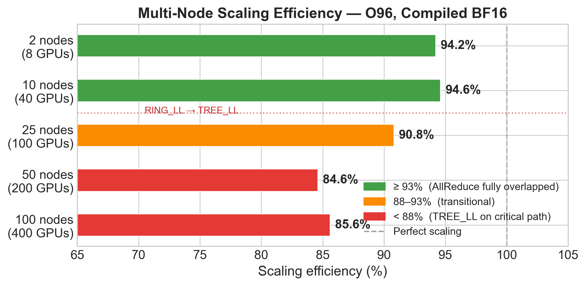
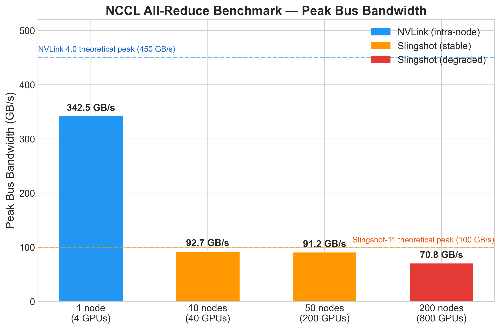
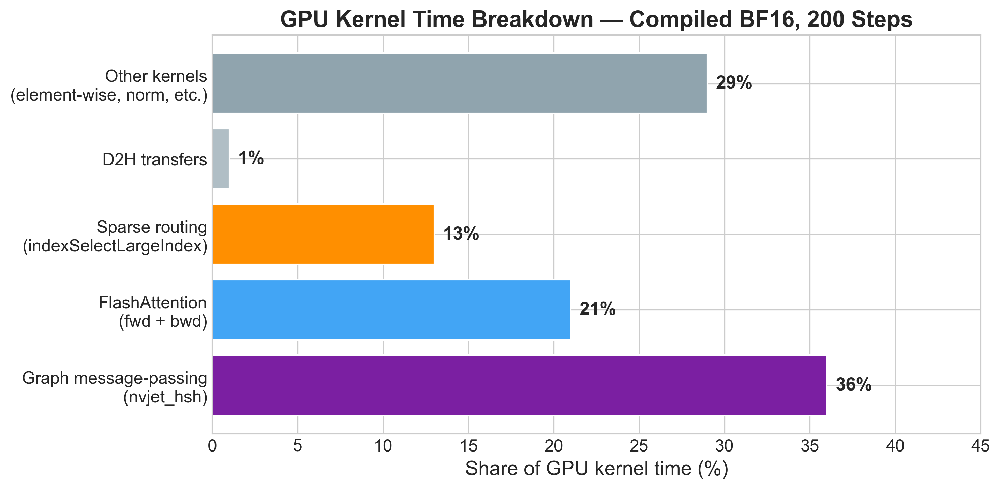
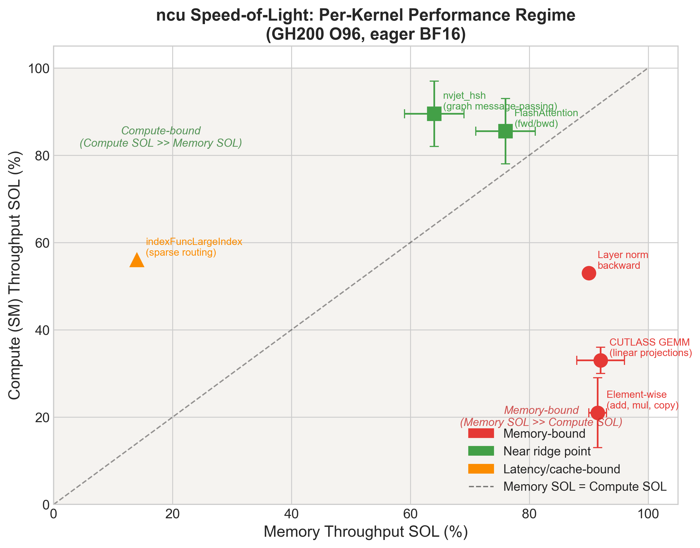
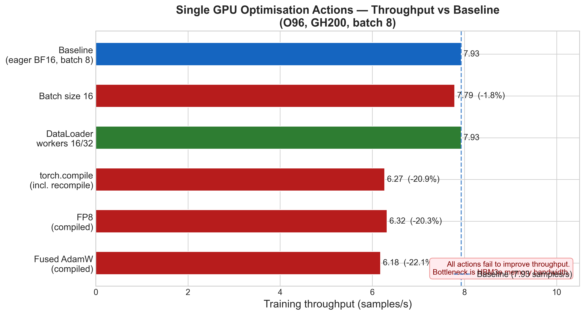
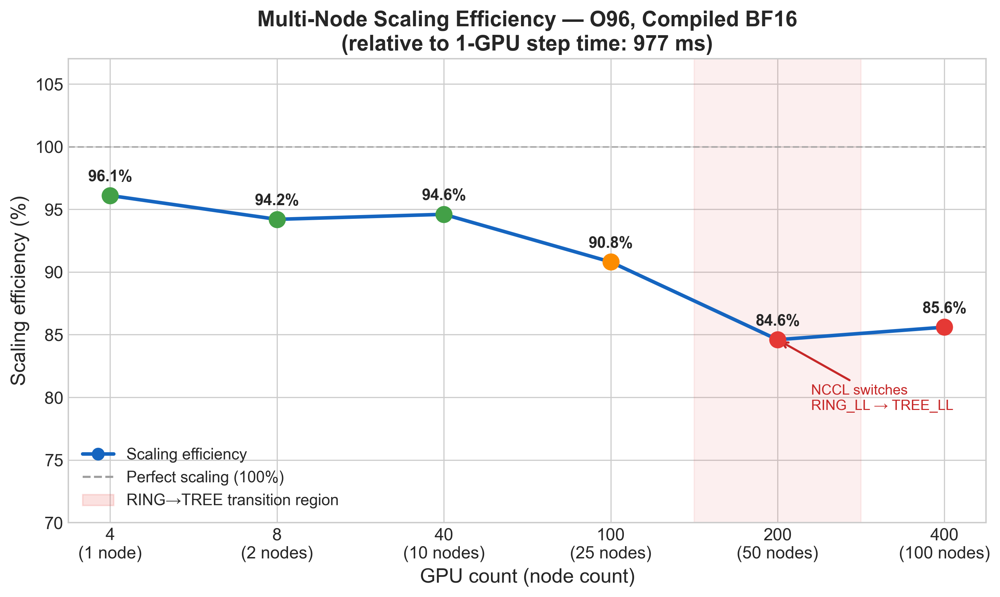
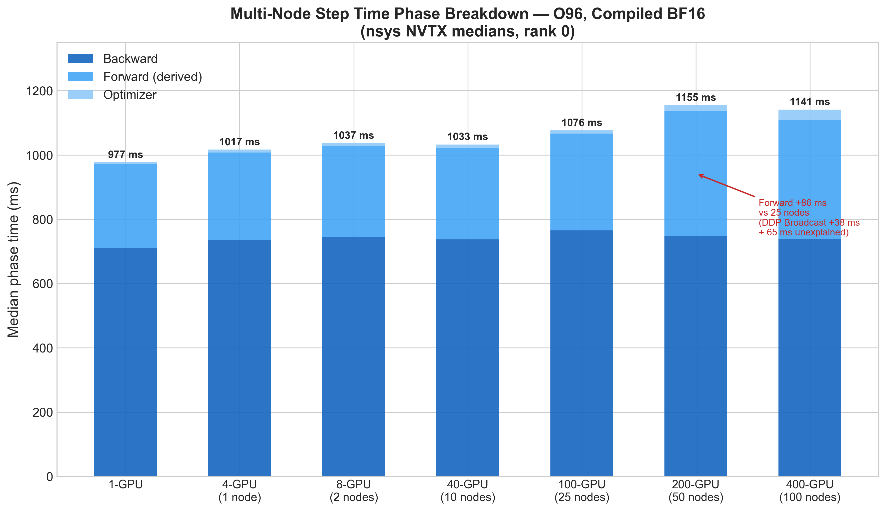
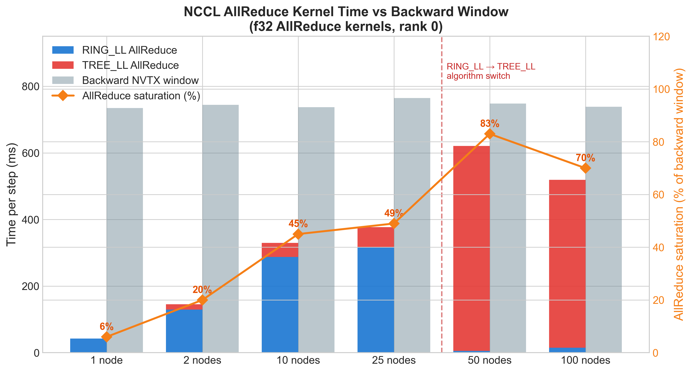
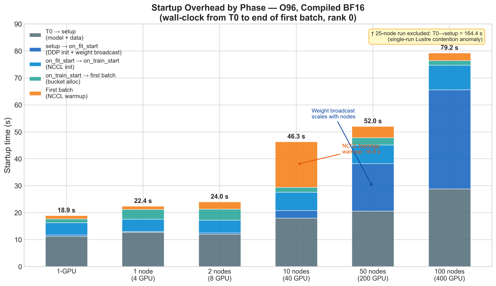

# Performance Characterisation of Anemoi Training on Isambard-AI

## Introduction

Anemoi is an open-source framework developed by ECMWF (The European Centre for Medium-Range Weather Forecasts) for training data-driven numerical weather prediction models [1, 2]. Its flagship models are graph-based neural networks that operate over irregular geographic meshes, combining a Graph Transformer encoder-processor-decoder architecture with domain-specific spherical harmonics kernels. Training these models at production resolution is computationally intensive: a single training step on the `O96` dataset [3] — an octahedral reduced Gaussian grid with approximately 1° (≈111 km) horizontal resolution and ~40,320 grid points — requires ~187 TFLOPs of computation and generates ~95 GB of theoretical activation memory, necessitating both high-memory accelerators and efficient distributed training across many nodes. The `N320` dataset (a higher-resolution octahedral grid, approximately 0.25°) is used for initial scaling comparisons alongside `O96`; both datasets reach the same wall-clock minimum at 100 nodes with the same setup-overhead growth pattern, though `N320`'s heavier per-step compute delays the crossover point. All detailed profiling focuses on `O96`, as the bottleneck characterisation is expected to carry over to `N320`.

Isambard-AI [4] is a UK national AI research supercomputer hosted at the University of Bristol, based on NVIDIA GH200 Grace Hopper Superchips [5, 16]. Each node provides 4 GH200 GPUs with 96 GB HBM3e each, connected intra-node via NVLink, and inter-node via the HPE Slingshot 11 high-speed interconnect [17]. Isambard-AI is one of the first large-scale GH200 deployments available for open research, and its performance characteristics for distributed deep learning workloads — particularly for memory-bandwidth-bound models like Anemoi — are not yet well characterised.

This report documents a systematic investigation of Anemoi training performance on Isambard-AI, starting from a single GPU and scaling up to 100 nodes (400 GPUs) for detailed profiling. The scope is limited to computational performance characterisation — throughput, step time, scaling efficiency, and hardware utilisation. Model quality and training convergence are not assessed. The work is structured around three questions:

1. **What is the single-GPU performance ceiling on GH200, and what are the bottlenecks?**
2. **How efficiently does Anemoi scale across 4 GPUs within a single node (NVLink)?**
3. **How does multi-node scaling behave over Slingshot, and where does communication become the bottleneck?**

The report is organised as follows. An **Executive Summary** immediately follows this introduction with the key findings and recommendations across all tiers. The **Initial Scaling Tests** section presents epoch-level strong scaling results for both `O96` and `N320` datasets, establishing the wall-clock optimum and identifying setup overhead as a growing cost at large node counts. The **NCCL Benchmarking** section establishes that the physical interconnect is not the source of the observed overhead, motivating the software-focused investigation that follows. The **Single GPU** section characterises the hardware utilisation and software bottleneck profile of a single GH200, working through a sequence of optimisation actions culminating in a clean hardware-bound baseline. The **Single Node Multi-GPU Scaling** section investigates intra-node DDP overhead and its node-to-node variability. The **Multi-Node Scaling** section quantifies per-step scaling efficiency from 2 to 100 nodes, characterises NCCL communication behaviour, and measures startup overhead growth.

## Executive Summary

Anemoi training on Isambard-AI GH200 nodes was characterised across three tiers: single GPU, single node (4-GPU NVLink), and multi-node (Slingshot interconnect). The findings at each tier feed directly into the next, and together identify a clear set of bottlenecks and the configurations under which Anemoi scales well.

### Single GPU

The `O96` model on a single GH200 achieves ~0.97 s/step (7.93 samples/s) in eager mode. Profiling establishes that the workload is **memory-bandwidth bound**: GPU utilisation is 92.8%, but Tensor Core utilisation is only ~1.2% and Model FLOP Utilisation is ~20% of the GH200 dense BF16 peak. Direct hardware measurement with ncu confirms this: CUTLASS GEMM kernels reach 88–96% of peak HBM3e bandwidth but only 30–36% of peak compute throughput, placing them deep in the memory-bound region of the roofline. The GPU is continuously busy, but the dominant kernels do not have sufficient arithmetic intensity to exploit Tensor Cores.

The main software bottleneck identified was CPU dispatch overhead: ~3,130 kernel launches per step with frequent `aten::nonzero` synchronisation stalls. `torch.compile` fused over 50,000 element-wise operations via Triton and removed all `cudaStreamSynchronize` stalls, but did not produce a measurable throughput improvement — the workload is memory-bandwidth bound and kernel fusion alone cannot change that. The hardware ceiling is HBM3 memory bandwidth, which is a characteristic of the model's arithmetic intensity and cannot be removed without architectural changes.

Activation checkpointing (`num_chunks: 2`) is required to fit within 96 GB HBM3e (34.1 GB peak vs 95.1 GB theoretical). Disabling it does not change step time, confirming the bottleneck is not recompute overhead.

### Single Node (4 GPUs, NVLink)

On a correctly configured node, 4-GPU scaling efficiency is **95.7%** (44 ms overhead, 987 ms → 1,031 ms/step). The NVLink `All-Reduce` is fully overlapped with the backward pass and is not on the critical path.

Early runs showed 76.5% efficiency due to `CUDA_LAUNCH_BLOCKING=1` present in the job environment, which forces every kernel launch to block until completion. With ~3,130 launches per step this produced up to 247 ms of overhead per step. Once identified and unset, efficiency recovered to 95.7%.

### Multi-Node Scaling (Slingshot interconnect)

Multi-node scaling was characterised from 2 to 100 nodes (8 to 400 GPUs) on `O96`. The headline results:

*Figure 0.1. Scaling efficiency at each node count. Green bars (≥ 93%) indicate full AllReduce overlap; the drop below 88% at 50–100 nodes marks the onset of TREE_LL communication on the critical path.*

Efficiency is excellent up to 10 nodes (~94–95%) and degrades gradually to ~85% at 50 nodes, where it stabilises. The primary mechanism is the **NCCL algorithm switch**: up to 10 nodes NCCL uses RING_LL and `All-Reduce` is fully overlapped within the backward pass. At 50 nodes NCCL switches predominantly to TREE_LL, pushing AllReduce kernel time to 621 ms/step and saturating 83% of the 748 ms backward window — overlap ends and communication appears on the critical path.

**Wall-clock optimum** for `O96` is 100 nodes (82 s/epoch); for `N320` also ~100 nodes (669 s/epoch). Scaling beyond 100 nodes offers no wall-clock benefit and degrades cost efficiency sharply.

**Startup overhead** becomes a significant fraction of total job time at scale — 52 s at 50 nodes, 79 s at 100 nodes — driven by the DDP weight broadcast (36.8 s at 100 nodes) and NCCL first-batch warmup (11.1 s at 10 nodes). Reducing startup overhead is the higher-priority improvement at large node counts.

### Where to Look for Performance Improvements

For readers focused on improving training throughput or reducing job turnaround time:

- **Single-GPU throughput** — the dominant kernel classes (GEMMs, element-wise operations) are hardware-bound at the HBM3 memory-bandwidth ceiling; no software change can address this without increasing arithmetic intensity. The one actionable cost centre is `indexSelectLargeIndex` (~13% of runtime), which is latency/cache-bound due to irregular sparse access and could be reduced by pre-computing graph indices. `nvjet_hsh` (~36% of runtime) is already near the ridge point and is not a target. Details are in [Optimisation Actions](#optimisation-actions).
- **Single-node efficiency** — 96.1% at 4 GPUs relative to 1 GPU; there is limited scope for further improvement. The residual forward-pass overhead is characterised in [Action 8: Characterising the Multi-Rank Overhead with NVTX Markers](#action-8-characterising-the-multi-rank-overhead-with-nvtx-markers).
- **Multi-node step time** — at 50+ nodes, AllReduce communication saturates the backward window and is on the critical path. Potential levers are discussed in [Action 1: Baseline Multi-Node Training Runs](#action-1-baseline-multi-node-training-runs-2100-nodes) under *Performance improvement opportunities*.
- **Multi-node startup time** — at 100 nodes startup overhead accounts for ~79 s, dominated by the DDP weight broadcast and NCCL warmup. Targets are documented in [Action 2: Startup Overhead](#action-2-startup-overhead) under *Startup improvement opportunities*.

## Initial Scaling Tests

### `O96` Strong Scaling

Initial strong scaling experiments were run for the `O96` dataset, training for 2 epochs across node counts of 1, 10, 50, 100, 200, and 500. For each run, two metrics were recorded: `Slurm Total Time` (wall-clock duration from job start to finish, measuring how fast the training completes) and `Total Node Hours` (the product of node count and wall-clock time, measuring total compute consumed — a proxy for cost). Both are plotted below on a log-log scale.

*Figure 1. `O96` Strong Scaling Performance.*

- Wall-clock time falls from 4,239 s (1 node) to 244 s (100 nodes), then reverses: 420 s at 200 nodes, 1,170 s at 500 nodes.
- Total node hours increase monotonically throughout (1.18 h → 162.5 h), so beyond 100 nodes both time and cost worsen — further scaling is counterproductive for `O96`.

In addition to the strong scaling analysis, the total job time is decomposed into two components: training time (the time spent executing forward and backward passes) and setup time (the overhead before training begins, covering model initialisation, dataset loading, and distributed environment setup). Note that training + setup does not exactly equal the `Slurm Total Time` shown in Figure 1 — the small residual (~30 s) reflects Slurm scheduling and node allocation overhead not captured by either timer. The following plot illustrates this breakdown:

*Figure 2. `O96` Training Time Analysis.*

- Training time drops from 4,189 s (1 node) to 82 s (100 nodes), while setup time grows from 23 s (1 node) to 1,000 s (500 nodes).

- Beyond 100 nodes the crossover makes scaling counterproductive: at 200 nodes setup time (275 s) is already more than double the training time (117 s), and at 500 nodes nearly eight times longer (1,000 s vs 129 s).

### `N320` Strong Scaling

The `O96` results identified 100 nodes as the wall-clock minimum and setup overhead as the dominant cost beyond it. The `N320` dataset — a significantly higher-resolution workload — tests whether heavier per-step compute shifts this picture. Greater computational intensity per GPU means more useful work per synchronisation step, which should extend the range over which scaling remains efficient.

The model was trained for 2 epochs across node counts of 1, 2, 8, 10, 25, 50, 100, and 200 nodes. Testing beyond 200 nodes was not performed given resource constraints and the trends already established with `O96`.

*Figure 3. `N320` Strong Scaling Performance.*

- Wall-clock time falls steadily from 33,444 s (1 node) to 669 s (100 nodes) — a wider effective scaling range than `O96`. `N320`'s ~5× larger grid (~204,800 vs ~40,320 grid points) produces larger GEMM dimensions and higher arithmetic intensity per step, making communication a smaller fraction of total step time and sustaining efficient scaling further. Cost also grows more slowly: total node hours remain relatively stable up to 25 nodes (9.29 h → 13.49 h), unlike `O96` where cost rose steeply from the outset.

- At 200 nodes the wall-clock gain is negligible (669 s → 642 s) while total node hours nearly doubles (18.58 h → 35.67 h), confirming 100 nodes as the potential wall-clock minimum for `N320` as well.

The total job time is again decomposed into training time and setup time to understand the plateau at 200 nodes.

*Figure 4. `N320` Training Time Analysis.*

- Training time falls smoothly from 33,384 s (1 node) to 312 s (200 nodes). Setup time rises from 32 s to 289 s — the same growth pattern seen in `O96`, but the heavier workload keeps training dominant for longer.

- At 200 nodes training (312 s) and setup (289 s) are nearly equal, each accounting for ~50% of total job time. This explains the plateau: as the GPUs compute faster with more nodes, the growing initialisation cost offsets the gain, preventing any further reduction in wall-clock time.

## NCCL Benchmarking

Before undertaking the detailed per-tier investigation — from single GPU through single node to multi-node — a hardware sanity check was performed to rule out the physical network as the source of the scaling overhead observed in the initial tests.

NCCL (NVIDIA Collective Communications Library) [6] is the communication backend used by PyTorch for gradient synchronisation in distributed training. It implements collective operations such as `All-Reduce` — the operation that averages gradients across all GPUs at the end of each backward pass — and is optimised for NVIDIA interconnects including NVLink (intra-node) and high-speed fabrics such as Slingshot (inter-node). The NCCL `All-Reduce` benchmark measures the raw bandwidth of this operation using synthetic data, isolating the interconnect from any framework or training overhead. This provides a hardware speed limit against which software-level bottlenecks can be judged.

NCCL `All-Reduce` benchmarks were carried out on Isambard-AI across 1, 10, 50, and 200 nodes.

*Figure 5. Peak bus bandwidth of NCCL `All-Reduce` as a function of node count. NVLink (1 node) provides 342.5 GB/s; Slingshot bandwidth is stable at 91–93 GB/s from 10 to 50 nodes, dropping ~23% at 200 nodes.*

Bandwidth is stable between 10 and 50 nodes (92.7 → 91.2 GB/s), confirming that the scaling degradation seen in the initial tests is **not** caused by network bandwidth. The gradient tensor size is fixed by model parameters and does not grow with node count, so the volume of data to synchronise is also not the primary cause. What does grow with node count is the number of participating ranks, which increases `All-Reduce` latency and can affect NCCL algorithm selection and collective coordination overhead. The following sections investigate the source of overhead tier by tier — beginning with single-GPU performance characterisation, then single-node multi-GPU communication overhead, and finally multi-node scaling behaviour.

## Single GPU

Five profiling tools were used in sequence to characterise performance, each answering a different question:

| Tool | What it measures | Key question answered |
| :--- | :--- | :--- |
| **Anemoi simple profiler** | Step time, throughput, forward/backward/optimizer breakdown | What is the baseline throughput and how does each action change it? |
| **Anemoi detailed profiler** | Model characteristics: parameter count, TMACs, theoretical activation memory, peak measured memory | What are the model's compute and memory demands, and is activation checkpointing necessary? |
| **PyTorch Profiler / TensorBoard** | Operator host time, GPU utilisation, Tensor Core utilisation, kernel occupancy | Which operations are slow, and what do indirect hardware metrics indicate? |
| **nsys (Nsight Systems)** [14] | CPU–GPU timeline, CUDA API time, kernel launch counts, kernel time by type | Is the GPU being kept busy, and do software changes alter the underlying dispatch structure? |
| **ncu (Nsight Compute)** [13] | Per-kernel memory and compute throughput as % of hardware peak (Speed-of-Light) | Are kernels actually memory-bound or compute-bound at the hardware level? |

Together they form a funnel — from throughput at the top down to direct hardware measurement — progressively narrowing the diagnosis from *slow* to *why*.

### Baseline Characterisation

<!-- 
 simple:
 /home/u5gd/tomas.u5gd/u5gd_shared/tomas/anemoi_workspace/experiments/2_O96/5_1gpu_profiling/1_baseline/simple

 detailed:
 /home/u5gd/tomas.u5gd/u5gd_shared/tomas/anemoi_workspace/experiments/2_O96/5_1gpu_profiling/1_baseline/detailed
 -->

A baseline profiling run on a single NVIDIA GH200 GPU for 40 training steps on the `O96` dataset establishes that the workload is **memory-bandwidth bound**: GPU utilisation is 92.81% but Tensor Core utilisation is only ~1.1%, achieved occupancy is 41.92%, and Model FLOP Utilisation is ~20% of the GH200 dense BF16 peak — the GPU is continuously busy, but on memory-bound work rather than the dense matrix operations that Tensor Cores accelerate. The `detailed` profiler adds ~10% step-time overhead versus `simple` (concentrated in CPU-side instrumentation); simple profiling is used for all throughput comparisons throughout this report.

The detailed profiler reports the following model characteristics:

| Metric | Value | Note |
| :--- | :--- | :--- |
| **Model Size** | 231 M params (462 MB) | Small by parameter count |
| **Compute Load** | 23.42 TMACs / 46.84 TFLOPs per forward pass | High compute density relative to model size |
| **Theoretical Activation Memory** | 95.1 GB | Estimated peak activation volume (pre-checkpointing); exceeds usable HBM3e, motivating `num_chunks` checkpointing |
| **Measured Peak Memory** | 34.1 GB (with `num_chunks: 2`) | 61 GB without checkpointing |
| **Architecture** | Graph Transformer | Encoder-Processor-Decoder |
| **Scale** | 322k input / 87k latent nodes | Large input graph drives high activation volume |

Despite having only 462 MB of weights, the graph-based architecture generates disproportionately large activations (~205 bytes of theoretical activation per byte of model parameters). Activation checkpointing (`num_chunks: 2`) is required to fit within 96 GB HBM3e. Varying `num_chunks` controls the memory–compute trade-off: `num_chunks: 1` raises peak to 61 GB; `num_chunks: 16` lowers it to 33 GB. Crucially, step time is insensitive to this setting — **the bottleneck is not activation memory**.

**Model FLOP Utilisation (MFU).** With `num_chunks: 2`, activation checkpointing adds one extra forward recomputation, making the total per-step cost equivalent to 4 forward passes:

> 4 × 23.42 TMACs × 2 FLOPs/MAC = **187.4 TFLOPs per step**

At an avg batch time of 0.97 s (simple profile), this yields **~193 TFLOP/s** — approximately **20% of the GH200’s 989 TFLOP/s dense BF16 peak**. A ~20% MFU is consistent with a memory-bandwidth-bound workload.

### Optimisation Actions

The baseline identified three concrete observations: (1) ~60 GB of unused VRAM, (2) heavy element-wise kernel fragmentation with CPU–GPU synchronisation stalls, and (3) only ~1.1% Tensor Core utilisation. Four software actions target these observations independently (they are not stacked); the nsys deep-dive then characterises what changed structurally and whether those changes translated to throughput gains:

| Action | Change | Hypothesis |
| :--- | :--- | :--- |
| **1 — Batch Size** | 8 → 16 | More data per step saturates memory bandwidth and improves GPU utilisation |
| **2 — DataLoader Workers** | 8 → 16/32 | More prefetch workers eliminate any residual data starvation |
| **3 — torch.compile** [15] | Eager → compiled | Kernel fusion via Triton reduces element-wise fragmentation and CPU dispatch overhead |
| **4 — FP8 Precision** | BF16 → FP8 | Halving weight precision reduces data movement, potentially closing the memory-bandwidth gap |

- **Action 1 — Batch Size 16:** No throughput gain (−1.8%, simple profiler). Step time doubled with 2× data; peak memory doubled to ~72% of HBM3e. The bottleneck is not data supply.
- **Action 2 — DataLoader Workers (16/32):** No effect (<3% spread across 8, 16, 32 workers, within noise). Data loading is not the bottleneck.
- **Action 3 — torch.compile:** No throughput benefit (avg batch time +7.5% over 200 steps, including recompilation overhead). Operator fusion reduced kernel launches by 31% and peak memory by 10% (34.2 → 30.7 GB). Tensor Core utilisation remained ~1.2% — the memory-bandwidth bound character of the workload is unchanged by fusion.
- **Action 4 — FP8 Precision:** No meaningful throughput improvement (+0.8%). FP8 offers no advantage when the bottleneck is HBM3 bandwidth, not arithmetic throughput. AMAX scaling adds CPU contention. BF16 is recommended.

Detailed data tables for each action are in [Supplementary Material: Single GPU Profiling Detail](#supplementary-material-single-gpu-profiling-detail).

### nsys Deep-Dive

nsys profiling at three stages of optimisation (baseline eager, compiled, compiled with further changes) tracks how the CPU–GPU interaction changes and confirms that removing software inefficiencies does not shift the hardware ceiling.

At baseline, `cudaStreamSynchronize` accounted for **91% of CUDA API time** (~147 s over 200 steps) with 625,957 CUDA kernel launches (~3,130/step). GPU utilisation remained 92.81% — the stalls were entirely CPU-side and did not starve the GPU. `torch.compile` eliminated these stalls and reduced kernel launches by 31% (~429,000), but delivered no throughput improvement.

With CPU-side stalls eliminated, the remaining GPU kernel time for 200 steps breaks down as:

*Figure 6. GPU kernel time breakdown by type (200 steps, compiled BF16, rank 0). `nvjet_hsh` dominates at ~36%; FlashAttention contributes ~21%; sparse routing (`indexSelectLargeIndex`) accounts for ~13%.*

`flash_fwd_kernel` is called 2× more often than `flash_bwd_kernel`, confirming activation checkpointing is active. Fused AdamW showed no improvement (+0.2% avg batch time) — the optimizer update is not a meaningful cost centre.

**Conclusion:** `torch.compile` eliminated all `cudaStreamSynchronize` stalls and reduced kernel launches by 31%. However, since the GPU was already memory-bandwidth bound at baseline, removing the CPU-side stalls did not improve throughput. The hardware ceiling is HBM3 memory bandwidth. Compiled BF16 is used as the starting point for multi-node scaling experiments.

### ncu Hardware Measurement

`nsys` shows *when* the GPU is busy; ncu (Nsight Compute) [13] measures *how efficiently* each kernel uses the hardware. By replaying each CUDA kernel with hardware performance counters, ncu reports Speed-of-Light (SOL) metrics — memory bandwidth and compute throughput as a percentage of theoretical peak. GH200’s ridge point is ~495 FLOP/Byte (1,979 TFLOP/s peak BF16 ÷ 4.0 TB/s peak HBM3e bandwidth [5, 16]); kernels below this arithmetic intensity are memory-bound regardless of GPU utilisation [10]. ncu was run on the baseline (eager BF16) configuration using `--set roofline`, capturing 500 kernels after skipping one warmup step (~3,130 kernel launches), covering all distinct kernel types.

The per-kernel SOL metrics reveal three distinct performance regimes:

*Figure 7. Roofline scatter plot of Memory SOL (x-axis) vs Compute SOL (y-axis) for the dominant kernel types. Kernels in the upper-right are near the ridge point; kernels shifted left are memory-bound. The GH200 ridge point (~495 FLOP/Byte) separates the memory-bound and compute-bound regions.*

See [ncu Speed-of-Light values per kernel](#ncu-speed-of-light-values-per-kernel) in Supplementary Material for the numerical breakdown.

**GEMM kernels are memory-bound.** Linear projections — which should saturate Tensor Cores on large matrices — are instead bottlenecked by HBM3e bandwidth. This is the direct hardware confirmation of low Tensor Core utilisation observed via TensorBoard. O96's matrix dimensions are determined by the number of grid points (~40,320) and the batch size; the resulting arithmetic intensity falls well below GH200's ridge point of ~495 FLOP/Byte, placing every GEMM in the memory-bound region of the roofline.

**`nvjet_hsh` and FlashAttention are near the ridge point.** Both memory and compute SOL are high simultaneously, meaning these kernels are well-optimised and are not the limiting bottleneck. FlashAttention [11] achieves high arithmetic intensity by tiling the key/value matrices in SRAM, avoiding repeated HBM reads.

**Sparse routing is latency-bound.** `indexFuncLargeIndex` shows low SOL on both axes — it is bottlenecked by irregular memory access patterns from Anemoi's geographic mesh connectivity, not by bandwidth or compute capacity.

**Conclusion:** Direct hardware measurement confirms that the dominant kernel classes (GEMMs and element-wise operations) are operating deep in the memory-bound region of the roofline, saturating HBM3e bandwidth while leaving Tensor Core capacity largely idle. The 1.1% Tensor Core utilisation figure from TensorBoard is a weighted average reflecting the 29% of GPU time spent in kernels with near-zero Tensor Core usage. Software optimisation cannot resolve this — the arithmetic intensity of the O96 problem size is the fundamental constraint.

### Summary

Different step-time figures appear across sections because they use different tools and scopes:

| Step time | Source | Steps | What it includes |
| :--- | :--- | ---: | :--- |
| ~0.77 s | nsys GPU kernel time | 200 | CUDA kernel execution only |
| 0.97 s | Anemoi simple profiler (`run_training_batch`) | 40 | Forward + backward + optimizer; excludes inter-step overhead |
| 0.98 s | Anemoi simple profiler | 200 | Same scope; slight run-to-run variance |
| ~0.96 s | Anemoi simple profiler | 200 | Consistent across nodes; used as the single-node reference |
| 0.954–0.987 s | Anemoi simple profiler (NVTX runs) | 200 | Node-specific; used in single-node DDP experiments |

All throughput and scaling comparisons use the simple profiler (`run_training_batch`) unless explicitly stated otherwise.

Each action was tested independently against the baseline (batch size 8, eager BF16); they are not stacked:

*Figure 8. Training throughput (samples/s) for each optimisation action versus baseline. All actions fail to improve throughput, confirming the bottleneck is HBM3e memory bandwidth rather than any software inefficiency.*

See [Single GPU Optimisation Actions: Full Results](#single-gpu-optimisation-actions-full-results) in Supplementary Material for per-action timing and memory figures.

Two remaining cost centres are worth noting, but with different outlooks:

- **`indexSelectLargeIndex` (~13% of runtime):** Latency/cache-bound due to irregular sparse memory access patterns from Anemoi's geographic mesh connectivity (ncu: Memory SOL 14%, Compute SOL 56%). Pre-computing and caching graph indices could reduce this cost without changing model behaviour.
- **`nvjet_hsh` kernels (~36% of runtime):** Operating near the ridge point of the roofline (ncu: Memory SOL 65–75%, Compute SOL 80–95%) — already well-optimised. Unlike the GEMM and element-wise kernels, these are not the bottleneck and are not a target for optimisation.

The single-GPU investigation establishes that the dominant kernel classes are hardware-bound at the HBM3 memory-bandwidth ceiling. The one software-addressable cost centre — `indexSelectLargeIndex` (~13% of runtime), which is latency/cache-bound due to irregular sparse access patterns — could be reduced by pre-computing graph indices, but would not change the fundamental memory-bound character of the workload. The **eager BF16, batch size 8** configuration is carried forward as the 1-GPU reference baseline for all single-node multi-GPU experiments — compiled BF16 is reserved for direct comparison within those experiments.

## Single Node Multi-GPU Scaling

Each Isambard-AI node hosts **4 GH200 GPUs** connected via NVLink. Moving from 1 to 4 GPUs introduces the first layer of distributed communication: intra-node NCCL `All-Reduce` over NVLink, which synchronises gradients across GPUs at the end of each backward pass.

**Intra-node scaling result.** On a correctly configured node, 4-GPU scaling efficiency is **95.7%** — approximately 1,031 ms/step at 4 GPUs vs 987 ms/step at 1 GPU, a 44 ms (4.3%) overhead. This is within the expected range for a graph model communicating over NVLink.

**Background.** Early single node/4-GPU runs showed **76.5% efficiency** (step times ranging from ~1,185 ms to ~1,234 ms across different nodes and profiling configurations). `CUDA_LAUNCH_BLOCKING=1` was present in the SLURM job environment — carried over from a prior session — but was not recognised as the cause, triggering a seven-action investigation before the root cause was found. The key lesson: **verify the job environment before beginning any performance investigation**. A misconfigured environment variable invalidated the initial baseline and drove a substantial profiling campaign that could have been avoided.

`CUDA_LAUNCH_BLOCKING=1` forces every CUDA kernel launch to be synchronous, turning ~11 µs async dispatches into blocking waits. With ~625,000 kernel launches over 200 steps (~3,130 per step), the cumulative cost is ~220 ms. PyTorch DDP [12] amplifies the effect further through additional `cudaStreamSynchronize` calls for NCCL bucket coordination.

Despite being triggered by a misconfiguration, the investigation is retained in this report rather than removed. It covers NCCL overlap profiling, forward/backward isolation, DDP configuration, I/O and thermal ruling-out, and kernel dispatch analysis — the natural sequence of checks for any intra-node scaling regression — and serves as a practical diagnostic reference for future work. 

### Investigation Summary

The table below summarises each investigative action, the hypothesis tested, and the outcome. Full data tables for each action are in [Supplementary Material: Single Node Profiling Detail](#supplementary-material-single-node-profiling-detail).

| Action | Hypothesis | Outcome |
| :--- | :--- | :--- |
| 1 | Establish baseline | 76.5% efficiency observed; later identified as `CUDA_LAUNCH_BLOCKING=1` artefact |
| 2 | NCCL `All-Reduce` not overlapping with backward | **Ruled out** — fully overlapped, 22–45 ms/step (2.5% of backward window) |
| 3 | Forward overhead is a profiler artefact; `torch.compile` addresses it | **Negative** — proportional overhead on both phases (+29% fwd, +25% bwd); compile gives only 2.9% step benefit |
| 4 | DDP bucket size or gradient layout causing overhead | **Ruled out** — both alternatives marginally worse than default |
| 5 | Dataloader I/O contention starving the GPU | **Ruled out** — 9.8× dataloader headroom at 4 GPUs |
| 6 | Node heterogeneity or thermal throttling | **Both ruled out** — same-node test and dummy-load test |
| 7 | Multi-process resource contention (non-DDP) | **Ruled out** — 4× independent training processes matched 1-GPU baseline |
| 8 | Fine-grained NVTX + kernel dispatch analysis | **Root cause found** — `CUDA_LAUNCH_BLOCKING=1` causing 215 µs dispatch latency (vs 11 µs normal) |

### Action 1: Initial 4-GPU Baseline

**Observed 76.5% scaling efficiency** (1.22 s/step vs 0.97 s/step at 1 GPU; 8.23 → 6.30 samples/s per GPU). At this point `CUDA_LAUNCH_BLOCKING=1` was present in the environment and undetected. The apparent 26% step overhead triggered the investigation.

### Action 2: NCCL Communication Overlap

NCCL `All-Reduce` is **fully overlapped with the backward pass**: 22–45 ms/step (2.5% of the 882 ms backward window) across 31 buckets. Implied NVLink bandwidth is ~31 GB/s — 9% of the 342.5 GB/s NVLink peak. Load across all four ranks is balanced to <1 ms spread on the backward phase. NCCL is not the bottleneck.

### Action 3: Isolating the Overhead

An apples-to-apples comparison (both runs: simple profiler, no NVTX, no compile, 200 steps) showed the **forward pass is 29% slower at 4 GPUs** — DDP does no communication during the forward, so this cannot be a DDP artefact. Overhead was near-proportional across both phases (+29% forward, +25% backward), suggesting a node-level effect rather than DDP-intrinsic overhead. `torch.compile` gave only a 2.9% net step improvement at 4 GPUs.

### Action 4: DDP Configuration

Larger gradient buckets (`bucket_cap_mb=100`) and `gradient_as_bucket_view=True` both made performance worse (+1.7% and +1.2% step time respectively). The latter also collapsed dataloader throughput by 85% due to contention with the pinned-memory transfer pipeline. DDP configuration is not the cause.

### Action 5: Data Loading

Per-process dataloader throughput drops 38× under 4-GPU I/O contention, but retains **9.8× headroom** over training consumption. The GPU never stalls waiting for data. Data loading is not the bottleneck.

### Action 6: Node Heterogeneity and Thermal Throttling

A same-node 1-GPU vs 4-GPU test confirmed the overhead is real and not a node-comparison artefact (965 ms vs 1,185 ms on the same node). A throttle test — 1-GPU training alongside 3 compute-saturating dummy GPU loads — showed <0.5% step-time difference. Thermal and power-cap throttling are both ruled out.

### Action 7: Multi-Process vs Multi-Rank

Four independent 1-GPU training processes running simultaneously (no DDP) produced 970 ms/step — identical to the single-GPU baseline. The ~220 ms overhead is therefore specific to the multi-rank DDP configuration, not generic multi-process load.

### Action 8: Root Cause — CUDA_LAUNCH_BLOCKING

NVTX phase breakdowns across two nodes revealed dramatic variability:

| Phase (NVTX avg) | 1-GPU (nid010659) | 4-GPU (nid010706) | 4-GPU (nid010881) |
| :--- | ---: | ---: | ---: |
| Forward | 266 ms | 285 ms | 350 ms |
| Backward | 714 ms | 737 ms | 883 ms |
| Optimizer | 6.6 ms | 9.7 ms | 1.5 ms |
| **Step** | **987 ms** | **1,031 ms** | **1,234 ms** |
| **Overhead vs 1-GPU** | — | **+44 ms (+4.4%)** | **+247 ms (+25%)** |

`cudaLaunchKernel` dispatch latency identifies the root cause:

| Profile | Avg `cudaLaunchKernel` latency | Total kernel launches |
| :--- | ---: | ---: |
| 1-GPU baseline (nid010659) | 11.8 µs | 625,920 |
| 4-GPU best (nid010706) | 10.6 µs | 625,691 |
| 4-GPU worst (nid010881) | 215.3 µs | 625,691 |

Kernel launch counts are identical across configurations — multi-rank training introduces no extra launches. On nid010881, the 20× increase in dispatch latency (11 µs → 215 µs) is consistent with `CUDA_LAUNCH_BLOCKING=1` in the job environment, which forces kernel launches to block until completion. With ~3,130 launches per step the cumulative cost is ~220 ms. NCCL's higher CPU wake frequency amplifies this into disproportionate overhead. With a clean job environment (nid010706), the remaining 44 ms overhead arises from GPU stream fragmentation (~20 ms) and a forward-pass buffer broadcast stall (~19 ms).

**Verdict.** With a clean job environment, 4-GPU scaling efficiency is **95.7%** (987 ms → 1,031 ms/step). `CUDA_LAUNCH_BLOCKING=1` in the job environment is the sole cause of the degraded 76.5% efficiency seen in early runs. **Verify the job environment before any performance investigation.** The forward-pass buffer broadcast should be monitored at multi-node scale where it runs over Slingshot.

## Multi Node Scaling

With single-GPU and single-node behaviour established, this section characterises how Anemoi scales across multiple nodes connected via the HPE Slingshot 11 interconnect. The key questions are: how efficiently does gradient synchronisation scale from 2 to 100 nodes, where does NCCL communication become the critical-path bottleneck, and how large is the startup overhead relative to training time at scale? All runs use the `O96` dataset, eager BF16, batch size 8, and the same job environment controls established in the single-node section (`CUDA_LAUNCH_BLOCKING` and `TORCH_NCCL_BLOCKING_WAIT` explicitly unset).

### Action 1: Baseline Multi-Node Training Runs (2–100 Nodes)

<!-- 
1 gpu:
/home/u6fw/tomas.u6fw/u6fw_shared/tomas/anemoi_workspace/experiments/2_O96/6_1gpu_profiling/8_startup/simple_200_perf_nvtx/

1 node:
/home/u6fw/tomas.u6fw/u6fw_shared/tomas/anemoi_workspace/experiments/2_O96/7_1node_profiling/10_startup

2 nodes:
/home/u6fw/tomas.u6fw/u6fw_shared/tomas/anemoi_workspace/experiments/2_O96/8_2nodes_profiling/3_startup

10 nodes:
/home/u6fw/tomas.u6fw/u6fw_shared/tomas/anemoi_workspace/experiments/2_O96/9_10nodes_profiling/3_startup

50 nodes:
/home/u6fw/tomas.u6fw/u6fw_shared/tomas/anemoi_workspace/experiments/2_O96/10_50nodes_profiling/3_startup
 -->

**Goal:** Establish baseline step time and startup time at 2, 10, and 50 nodes to quantify the scaling efficiency and startup overhead growth beyond 1 node.

`CUDA_LAUNCH_BLOCKING` and `TORCH_NCCL_BLOCKING_WAIT` were explicitly unset before these runs, establishing a clean multi-node baseline free from the environment issue identified in the single-node section.

For the 1-GPU, 1 node, 2 nodes, and 10 nodes, 200 steps of the simple profiler with NVTX markers and `nsys profile` capture were used, whereas due to dataset size, the number of steps for the 50-node and 100-node runs had to be reduced to 40 and 24 respectively. Since 24–40 steps is still sufficient to get a stable median step time, this should not affect the validity of the scaling efficiency calculation, especially when comparing median times across runs.

Scaling efficiency is calculated as:

$$\text{Scaling Efficiency} = \frac{T_{\text{1-GPU}}}{T_{N\text{-GPU}}} \times 100\%$$

where $T_{\text{1-GPU}}$ is the median step time on 1 GPU and $T_{N\text{-GPU}}$ is the median step time with $N$ GPUs. This is equivalent to the throughput-ratio formulation used in the Single Node section ($\text{N-GPU total throughput} / (N \times \text{1-GPU throughput})$); step time and throughput are reciprocals, so the two expressions are identical. Each step processes $N$ times more data in parallel (one local batch per GPU), so the global batch size grows with GPU count and fewer steps are needed per epoch. A step that takes the same wall-clock time as the 1-GPU baseline therefore represents a perfect $N\times$ throughput improvement, and 100% efficiency means no overhead from parallelisation.

**Per-step scaling** (Simple profiler, NVTX, nsys profile, rank 0):

*Figure 9. Scaling efficiency vs node count. Efficiency is flat at ~94–96% up to 10 nodes, degrades to ~85% at 50 nodes, then stabilises. The drop at 50 nodes coincides with the NCCL RING_LL → TREE_LL algorithm switch.*

*Figure 10. Median step time decomposed into backward, forward (derived), and optimizer phases by node count. Backward is relatively stable; the forward residual grows sharply at 50 nodes, consistent with the DDP buffer broadcast scaling over Slingshot.*

See [Per-Step Scaling Summary](#per-step-scaling-summary) in Supplementary Material for the numerical breakdown.

Full per-step timing statistics (backward/forward/optimizer med/min/max/stddev) are in [Supplementary Material: Multi-Node Profiling Detail](#supplementary-material-multi-node-profiling-detail).

> [!NOTE]
> Each configuration is based on a single experiment. The reported values should be treated as indicative rather than statistically robust - run-to-run variance in step time, NCCL behaviour, and job scheduling noise are not accounted for. All timing statistics are collected from rank 0; in synchronous DDP training the effective step time is bounded by the slowest rank, so inter-rank variance is not captured and rank 0 may underestimate true wall-clock step time.

> [!IMPORTANT]
> Median is the correct central measure for step time in these runs. Mean-based metrics are likely to be heavily distorted by the first-batch NCCL warmup and should not be used to compare scaling performance across node counts.

- **Scaling efficiency declines gradually from 10 to 50 nodes, then stabilises.** It is flat up to 10 nodes (~94–96%), drops to 90.8% at 25 nodes, then to ~85% at 50 nodes, and holds there at 100 nodes (85.6%). The decline is not a single step-change but a progressive degradation in the 10–50 node range.

- **Backward peaks at 25 nodes (+7.9% vs 1-GPU) and eases at higher counts; NCCL `All-Reduce` is fully overlapped up to 10 nodes.**

To identify how much time is taken by NCCL communication and whether it is on the critical path, the GPU kernel time for the f32 AllReduce kernels `ncclDevKernel_AllReduce_Sum_f32_*` (the main NCCL collective for gradient synchronisation) can be compared to the backward NVTX wall time in `nsys stats` reports.

*Figure 11. NCCL AllReduce kernel time (RING_LL + TREE_LL) as a fraction of the backward NVTX window at each scale. Saturation remains below 50% up to 25 nodes (AllReduce fully overlapped), jumps to 83% at 50 nodes when NCCL switches to TREE_LL, then eases to 70% at 100 nodes.*

See [NCCL AllReduce Kernel Time per Scale](#nccl-allreduce-kernel-time-per-scale) in Supplementary Material for the numerical breakdown.

Total f32 AllReduce GPU kernel time per step grows 42.6 ms (1 node) → 145.6 ms (2 nodes) → 329.6 ms (10 nodes), yet the backward NVTX wall time at 10 nodes is only 737 ms (45% saturation) — the `All-Reduce` runs concurrently with compute and is not on the critical path.

At 25 nodes, AllReduce remains predominantly RING_LL (317.3 ms) with a growing TREE_LL component (59.8 ms), totalling 377.1 ms per step — 49% of the 764.9 ms backward window. Despite the low saturation, backward reaches its peak of 764.9 ms (+7.9% vs 1-GPU) at this scale. This suggests that at 25 nodes NCCL is operating in a transitional algorithm regime, and the mixed RING/TREE mode may introduce overhead beyond what pure saturation would predict. The cause is not established from the available data.

At 50 nodes, NCCL switches predominantly to TREE_LL, pushing total f32 AllReduce kernel time to 621 ms per step (TREE_LL: 615 ms + residual RING_LL: 5.5 ms) — 83% of the 748 ms backward window — ending full overlap.

At 100 nodes, total f32 AllReduce kernel time is 519 ms per step (TREE_LL: 504 ms + residual RING_LL: 15 ms) — 70% of the 738 ms backward window. Notably, TREE_LL kernel launches per step fall from 34 at 50 nodes to 29 at 100 nodes at similar per-launch cost — the reduction in total AllReduce time is a count effect rather than a per-kernel speedup. The cause of the reduced launch count is not established from the available data. The reduced window saturation (83% → 70%) is consistent with the small observed improvement in backward median (748.2 → 738.4 ms), though the 100-node backward StdDev is 169.4 ms — far larger than the improvement itself — so this difference should not be over-interpreted.

- **Derived forward is a residual (step − backward − optimizer) and includes all untagged overhead; it cannot be interpreted in isolation.** 

It is stable from 1-GPU to 10 nodes (261.8 → 284.8 ms, +23 ms total), rises moderately at 25 nodes (+17 ms), then jumps sharply at 50 nodes (+86 ms), then falls back slightly at 100 nodes (−19 ms).

`ncclDevKernel_Broadcast_RING_LL` (DDP buffer sync that runs before the forward pass) is one of the contributors within this residual: it grows from 23.6 ms/step at 10 nodes to 37.1 ms/step at 25 nodes to 62.1 ms/step at 50 nodes. The Broadcast growth from 10 to 25 nodes (+13.5 ms) roughly matches the forward residual growth over the same interval (+17.2 ms). From 10 to 50 nodes, the forward residual grows by +103 ms (284.8 → 387.9 ms). Broadcast accounts for +38.5 ms (~37%) of that; the remaining ~65 ms is not attributable to any kernel visible in the available data. At 100 nodes, Broadcast continues to grow to 101.6 ms/step (+39.5 ms vs 50 nodes), yet the derived forward drops by 18.6 ms — implying that other untagged components within the residual improved by ~58 ms. The cause is not established from the available data. **A full per-kernel GPU trace is needed to decompose the forward residual reliably.**

- **`cudaLaunchKernel` median is flat (8.2 → 7.4 µs across all scales)** — CPU dispatch is not a bottleneck at any scale tested.

See [Supplementary Material: Multi-Node Profiling Detail](#supplementary-material-multi-node-profiling-detail) for simple profiler cross-validation and statistical caveats on step-max and optimizer skew.

**Performance improvement opportunities:**

- **Set `broadcast_buffers=False` in DDP.** The `ncclDevKernel_Broadcast_RING_LL` kernel grows from 23.6 ms/step at 10 nodes to 62.1 ms/step at 50 nodes to 101.6 ms/step at 100 nodes (8.9% of total step time). The `O96` model uses Layer Norm, not Batch Norm, so this cross-rank buffer sync is unnecessary. Disabling it could potentially recover ~38 ms of unexplained forward overhead at 50 nodes and ~62 ms at 100 nodes, partially restoring scaling efficiency at both scales.

- **Investigate forcing RING_LL at 25–50 nodes or increasing gradient bucket size.** NCCL selects TREE_LL automatically beyond a rank-count threshold. At 25 nodes the algorithm is already in a mixed RING/TREE transitional regime (317.3 ms RING + 59.8 ms TREE per step), and at 50 nodes it switches predominantly to TREE_LL (615 ms/step), saturating 83% of the backward window and ending full overlap. Forcing RING_LL via `NCCL_ALGO=RING` may restore the ~95% efficiency seen at lower node counts. Alternatively, increasing the DDP gradient bucket size beyond the default 25 MB would reduce the ~34 AllReduce calls per step at 50 nodes (29 at 100 nodes), lowering per-step NCCL overhead regardless of algorithm. Note: the single-node profiling in Action 3 reports 31 buckets per step under the same 25 MB default; the reason the count differs at multi-node scale is not established from the available data.

- **Investigate and eliminate the unexplained 65 ms forward overhead at 50 nodes.** The DDP Broadcast (+38 ms) accounts for only 37% of the forward jump at 50 nodes. A full GPU kernel trace (`cuda_kern_sum`) at 50 nodes is needed to identify the remaining source — likely a synchronisation barrier or activation-checkpointing recompute scaling with world size. This is the single largest unresolved bottleneck.

- **Mitigate NCCL first-batch warmup (11.07 s at 10 nodes).** This is the dominant cost for short/debug runs. The warmup can be eliminated by adding a dummy forward/backward pass before the profiled window, or by pre-initialising NCCL communicators with a no-op collective before training begins.

- **Profile rank heterogeneity.** All timing data is from rank 0. The step max values (16,934 ms at 10 nodes) suggest at least one rank is significantly slower. Collecting profiles across all ranks — or at minimum the slowest rank — would confirm whether the efficiency loss at 50 nodes is uniform or driven by a single straggler.

### Action 2: Startup Overhead

**Method.** A lightweight Lightning callback ([`experiments/diagnostics/callbacks/startup_timer.py`](experiments/diagnostics/callbacks/startup_timer.py)) emits a timestamped log line at each key Lightning hook from rank 0 only. T0 is set at callback instantiation — after Python imports and Hydra config loading, but before model initialisation and Lightning setup.

The callback fires on `setup`, `on_fit_start`, `on_train_start`, `on_train_batch_start`, and `on_train_batch_end` (batch 0 only), then stops. No changes to `train.py` are required. The `delta` column directly identifies which phase grows between scales.

The phases map to the following operations:
- **T0 → setup**: model and graph construction, dataset open, weight initialisation.
- **setup → on_fit_start**: DDP model wrapping and weight broadcast from rank 0 to all ranks (462 MB over NVLink intra-node, Slingshot inter-node). The dominant cost at 50 nodes (+17.6 s).
- **on_fit_start → on_train_start**: NCCL process group initialisation and communicator setup.
- **on_train_start → first batch start**: gradient bucket allocation and data prefetch.
- **First batch**: forward + backward + first AllReduce, including NCCL topology negotiation warmup. The dominant cost at 10 nodes (+16.9 s).

**Startup overhead** (wall-clock from T0 to end of first batch, rank 0):

*Figure 12. Startup overhead decomposed by phase at each node count. The dominant cost shifts from NCCL first-batch warmup at 10 nodes (16.9 s) to DDP weight broadcast at 50–100 nodes (17.6–36.8 s). The 25-node T0→setup bar is anomalously tall (164.4 s) due to a single-run Lustre contention spike.*

| Phase | 1-GPU | 4-GPU (1 node) | 8-GPU (2 nodes) | 40-GPU (10 nodes) | 100-GPU (25 nodes) | 200-GPU (50 nodes) | 400-GPU (100 nodes) |
| :--- | ---: | ---: | ---: | ---: | ---: | ---: | ---: |
| T0 → setup (model + data ready) | 11.2 s | 12.7 s | 12.0 s | 18.0 s | 164.4 s † | 20.6 s | 28.8 s |
| setup → on_fit_start (Lightning init) | 0.5 s | 0.3 s | 0.5 s | 2.8 s | 5.8 s | 17.6 s | 36.8 s |
| on_fit_start → on_train_start (NCCL init) | 4.6 s | 4.6 s | 4.7 s | 6.8 s | 3.9 s | 6.9 s | 9.1 s |
| on_train_start → first batch start (bucket alloc) | 1.4 s | 3.6 s | 4.1 s | 1.8 s | 1.8 s | 2.7 s | 1.7 s |
| First batch (NCCL warmup) | 1.2 s | 1.2 s | 2.7 s | 16.9 s | 1.4 s | 4.2 s | 2.8 s |
| **Total** | **18.9 s** | **22.5 s** | **24.0 s** | **46.2 s** | **177.3 s †** | **52.0 s** | **79.1 s** |
| **vs 1-GPU** | — | +3.6 s | +5.1 s | +27.3 s | — † | +33.1 s | +60.2 s |

† The 25-node `T0 → setup` phase (164.4 s) is an anomalous outlier — 8× above any other case at comparable scale — consistent with a Lustre contention spike or a slow node assignment on this single run. All other 25-node phases are in range with surrounding cases. The total and vs-1-GPU values for 25 nodes are dominated by this artefact and are not comparable to the other entries.

- **The dominant bottleneck shifts with scale.** At 2 nodes the first batch accounts for most of the added startup cost (+1.5 s, first inter-node NCCL allreduce). At 10 nodes the first batch explodes to 16.9 s (NCCL topology warmup at 40 ranks). At 50 nodes the bottleneck moves to `setup → on_fit_start` (+17.1 s over the 1-GPU baseline), covering DDP model wrapping and the 462 MB weight broadcast to 200 ranks over Slingshot. At 100 nodes this phase doubles to 36.8 s (+36.3 s over baseline), consistent with the broadcast cost scaling linearly with node count.

- **First batch warmup is cheapest at the extremes.** At 10 nodes (40 ranks, RING_LL) it is 16.9 s; at 25, 50, and 100 nodes it is 1.4–4.2 s, consistent with the TREE_LL switch reducing the warmup cost for the `u32` scalar collective (`u32_TREE_LL` was 11.07 s at 10 nodes and only 1.63 s at 50 nodes).

- **NCCL process group init (`on_fit_start → on_train_start`) is stable** — grows from 4.6 s to 9.1 s across the full range. Communicator creation scales well; the cost is in the first data movement, not the setup itself.

- **At 50 and 100 nodes, startup time far exceeds training time for these short runs.** At 50 nodes: 52.0 s startup vs ~46 s training (40 steps × ~1.15 s/step). At 100 nodes: 79.1 s startup vs ~27 s training (24 steps × ~1.14 s/step) — startup is 3× longer than training. This reinforces the recommendation to run at least 200 steps at these node counts where dataset size permits.

- **T0 → setup grows modestly** (11.2 s at 1-GPU → 28.8 s at 100 nodes, +17.6 s), likely from parallel Zarr dataset opens on Lustre contending at higher rank counts. The 25-node spike (164.4 s) is a single-run anomaly, not a systematic scaling effect. At 100 nodes this phase is no longer the primary bottleneck — `setup → on_fit_start` (36.8 s) is.

**Startup improvement opportunities:**

- **Eliminate the weight broadcast at scale (potential −17.6 s at 50 nodes, −36.8 s at 100 nodes).** The `setup → on_fit_start` cost doubles from 17.6 s (50 nodes, 200 ranks) to 36.8 s (100 nodes, 400 ranks), consistent with the 462 MB broadcast scaling linearly with node count over Slingshot. The most direct fix is to load weights independently on each rank from a shared checkpoint on Lustre, removing the rank-0 broadcast entirely. A simpler intermediate option is to split the broadcast into per-node sub-groups (broadcast within NVLink domain first, then one representative per node does the cross-node transfer), reducing Slingshot traffic from 1×462 MB to N_nodes×(462 MB / N_nodes).

- **Pre-warm NCCL before the first training batch (potential −16.9s at 10 nodes).** A single no-op collective inserted after `on_train_start` but before the first batch — e.g. `dist.all_reduce(torch.zeros(1, device="cuda"))` — would trigger NCCL topology negotiation and channel warmup without affecting training. This would bring 10-node total startup from 46.2s to approximately 29s.

- **Stagger Zarr dataset opens to reduce Lustre contention (partial improvement to T0 → setup).** Currently all ranks open the same dataset files simultaneously. A simple fix is to stagger opens by local rank (`time.sleep(local_rank * 0.05)`) or have only one rank per node open files and broadcast metadata. This would not eliminate the 20.6s cost but would reduce the growth with rank count.

## Further Work

Each profiling tier concludes with a set of improvement opportunities and open questions that were identified but not pursued within the scope of this work. These are documented inline at the end of each section and can be picked up independently as follow-on investigations.

---

## Supplementary Material: Multi-Node Profiling Detail

This section contains supporting data and statistical caveats for the condensed findings in the [Multi Node Scaling](#multi-node-scaling) section.

### Simple Profiler Cross-Validation (Action 1)

The simple profiler provides per-rank averages complementary to the nsys rank-0 medians. All values are per-rank averages.

### Full Per-Step Timing Statistics (Action 1)

The condensed scaling summary in the main section omits per-phase min/max/stddev. Full statistics are below.

| Phase | 1-GPU | 4-GPU (1 node) | 8-GPU (2 nodes) | 40-GPU (10 nodes) | 100-GPU (25 nodes) | 200-GPU (50 nodes) | 400-GPU (100 nodes) |
| :--- | ---: | ---: | ---: | ---: | ---: | ---: | ---: |
| Step Med (ms) | 977.0 | 1016.8 | 1037.1 | 1032.7 | 1076.5 | 1154.8 | 1141.3 |
| Step Min (ms) | 966.1 | 996.2 | 1016.2 | 1003.2 | 1034.8 | 1024.8 | 562.8 |
| Step Max (ms) | 1189.3 | 1511.6 | 1563.8 | 16934.2 | 1555.4 | 4183.9 | 2806.9 |
| Step StdDev (ms) | 22.3 | 71.0 | 58.0 | 1180.8 | 114.3 | 502.4 | 470.1 |
| Backward Med (ms) | 708.9 | 734.9 | 744.2 | 737.2 | 764.9 | 748.2 | 738.4 |
| Backward Min (ms) | 701.6 | 723.7 | 714.6 | 686.2 | 741.3 | 714.5 | 384.9 |
| Backward Max (ms) | 921.9 | 992.6 | 914.1 | 958.3 | 837.2 | 867.7 | 823.5 |
| Backward StdDev (ms) | 17.0 | 22.1 | 16.6 | 36.4 | 17.6 | 30.7 | 169.4 |
| Optimizer Med (ms) | 6.3 | 8.9 | 8.6 | 10.7 | 9.6 | 18.6 | 33.6 |
| Optimizer Min (ms) | 5.4 | 7.3 | 7.3 | 6.3 | 5.9 | 7.8 | 7.7 |
| Optimizer Max (ms) | 62.7 | 346.4 | 79.7 | 3602.0 | 393.8 | 409.1 | 338.1 |
| Optimizer StdDev (ms) | 4.0 | 31.6 | 5.4 | 323.9 | 61.2 | 110.1 | 85.9 |
| Forward Med (derived) | 261.8 | 272.9 | 284.3 | 284.8 | 302.0 | 387.9 | 369.3 |
| `cudaLaunchKernel` Med (µs) | 8.224 | 8.736 | 8.128 | 7.712 | 7.488 | 7.392 | 7.712 |
| **Scaling efficiency** | 100% | 96.1% | 94.2% | 94.6% | 90.8% | 84.6% | 85.6% |
| **Effective GPU count** | 1.0 | 3.8 | 7.5 | 37.8 | 90.8 | 169.2 | 342.4 |
| **Wasted GPUs** | 0 | 0.2 | 0.5 | 2.2 | 9.2 | 30.8 | 57.6 |
| **Step overhead vs 1-GPU (ms)** | 0 | +39.7 | +60.1 | +55.7 | +99.5 | +177.7 | +164.3 |
| **Overhead per node (ms)** | — | 39.7 | 30.0 | 5.6 | 4.0 | 3.6 | 1.6 |

### Simple Profiler Cross-Validation

The simple profiler provides per-rank averages complementary to the nsys rank-0 medians. All values are per-rank averages.

| Metric | 1-GPU | 4-GPU (1 node) | 8-GPU (2 nodes) | 40-GPU (10 nodes) | 100-GPU (25 nodes) | 200-GPU (50 nodes) | 400-GPU (100 nodes) |
| :--- | ---: | ---: | ---: | ---: | ---: | ---: | ---: |
| `run_training_batch` avg (ms) | 980.0 | 1,027 | 1,046 | 1,197 | 1,113 | 1,286 | 1,129 |
| `backward` avg (ms) | 710.8 | 736.5 | 746.2 | 747.2 | 765.8 | 750.8 | 634.3 |
| `training_step` avg (ms) | 260.9 | 276.1 | 287.5 | 317.1 | 317.7 | 407.9 | 417.4 |
| Total throughput (samples/s) | 8.1 | 30.5 | 60.3 | 230.0 | 692.1 | 1,059 | 2,212 |
| Dataloader throughput (batches/s) | 9,364 | 4,548 | 7,152 | 7,697 | 7,888 | 7,555 | 8,242 |

- **`run_training_batch` avg tracks nsys step median closely at low node counts but diverges at scale** — the mean is sensitive to warmup outliers while the median is not. At 1-GPU to 2 nodes the gap is 3–9 ms (Lightning framework overhead: device transfer, callback hooks). At 10 nodes the gap widens to 164 ms and at 50 nodes to 131 ms, likely driven by the first-batch NCCL warmup inflating the mean. At 100 nodes the avg (1,129 ms) falls *below* the nsys median (1,141 ms) — with only 24 steps, the anomalously fast first step pulls the mean below the median. This is a further reason to use median, not mean, for step-time comparisons.
- **`training_step` avg is consistently wider than the nsys derived forward** — it wraps forward + loss computation. The gap grows with node count: ~0 ms at 1-GPU, +32 ms at 10 nodes, +16 ms at 25 nodes, +20 ms at 50 nodes, +48 ms at 100 nodes, consistent with the loss `All-Reduce` scaling with world size. The 100-node gap is larger than expected given its lower node count than 50 nodes — likely an artefact of the short 24-step run rather than a true scaling effect.
- **`backward` avg is consistent with the nsys median up to 50 nodes** (within 1.4%), confirming the two profilers agree. At 100 nodes the avg (634.3 ms) is 14% below the nsys median (738.4 ms) — caused by the anomalously short backward in the first of 24 steps pulling the mean down, the same artefact seen in the step min (384.9 ms).
- **Total throughput scales super-linearly in absolute terms** (8.1 → 2,212 samples/s, 273× at 100 nodes) as expected — each additional GPU adds a full local batch worth of compute.
- **Dataloader is not a bottleneck at any scale.** Throughput (4,500–9,400 batches/s) is far above the per-rank training consumption rate (0.69–1.01 batches/s), with ample headroom at all scales tested.

### Statistical Caveats (Action 1)

- **Step max and StdDev are elevated above steady-state at all multi-node scales and cannot be fully attributed from aggregate profiling data alone.** Step max excess above median ranges from 479 ms (25 nodes) to 15,901 ms (10 nodes). The NVTX summary does not record which step produced the maximum — only the aggregate min/max across all steps. The most likely contributor is a cold-start NCCL communicator on the first step: at 10 and 50 nodes, the single `ncclDevKernel_AllReduce_Sum_u32_TREE_LL` instance (11.07 s and 1.63 s respectively) is large enough that a first-step origin is certain. At 25 and 100 nodes the same kernel is negligible, so the step max excess could reflect a cold-start effect on a different collective, an intermittent NCCL stall, or scheduler-induced jitter on any step. A step-level kernel trace is required to distinguish these cases.

- **Optimizer max is heavily skewed at all multi-node scales while the median remains stable.** Optimizer NVTX max vs median (from `:optimizer` NVTX ranges, single-run): 3,602 ms vs 10.7 ms (10 nodes), 394 ms vs 9.6 ms (25 nodes), 409 ms vs 18.6 ms (50 nodes), 338 ms vs 33.6 ms (100 nodes). The optimizer NVTX range covers `clip_grad_norm_` — a scalar `All-Reduce` separate from the gradient buckets — which is a plausible source of a cold-start spike, but as with the step max, the aggregate summary does not identify which step produced the outlier. Steady-state optimizer median grows 6.3 ms (1-GPU) → 33.6 ms (100 nodes), consistent with normal gradient norm sync scaling with world size.

- **Backward minimum decreases at 10 nodes (686.2 ms vs 701.6 ms at 1-GPU) and falls anomalously low at 100 nodes (384.9 ms).** The 10-node dip suggests NCCL async overlap hides part of the compute latency in the best case. The 100-node figure is an artefact of the small 24-step run — a single unusually fast step pulls the minimum well below any plausible compute floor.

- **All figures are rank 0 only — the true step time is gated by the slowest rank.** Median and minimum values reflect rank 0 behaviour; in practice the job cannot advance until all ranks complete. The step max values (16,934 ms at 10 nodes, 1,555 ms at 25 nodes, 4,184 ms at 50 nodes, 2,807 ms at 100 nodes) are the better bound on worst-case job duration per step.

---

## Supplementary Material: Single GPU Profiling Detail

This section contains the detailed data tables supporting the condensed findings in the [Single GPU](#single-gpu) section.

### Profiler Overhead: Simple vs Detailed

The `detailed` configuration adds ~10% overhead versus `simple`, concentrated in CPU-side optimizer instrumentation rather than CUDA kernels. GPU-heavy operations (forward/backward passes) are barely affected (<2%).

**Metric definitions.** **Avg Batch Time** refers to the `run_training_batch` timer — the per-step time covering forward pass, backward pass, and optimizer update, excluding inter-step overhead. **Training Throughput** (samples/s) is derived from `training_avg_throughput × batch_size` and reflects end-to-end wall-clock speed including dataloader and framework overhead.

| Metric | Simple Profile | Detailed Profile | Delta (%) |
| :--- | :--- | :--- | :--- |
| **Total Epoch (40 steps) Time** | **39.22 s** | **43.35 s** | +10.5% |
| **Avg Batch Time** | 0.97 s | 1.06 s | +8.8% |
| **Training Throughput** | 7.93 samples/s | 7.01 samples/s | −11.6% |
| **Backward Pass** (Total) | 28.27 s | 28.39 s | +0.4% |
| **Forward Pass** (Total) | 10.18 s | 10.37 s | +1.9% |
| **Optimizer Step** (Total) | 38.80 s | 42.20 s | +8.8% |
| **DataLoader Next** (Total) | 0.11 s | 0.30 s | +173% |

> **Note:** The `Optimizer Step` timer spans the entire training step (including backward pass) and should not be interpreted as measuring optimizer-only cost.

The backward pass takes 28.27 s versus 10.18 s for the forward pass (2.8:1 ratio). With `num_chunks: 2` activation checkpointing, the backward pass requires one additional forward recomputation, raising its cost from the standard 2× to ~3× the forward — consistent with the observed ratio.

### TensorBoard Trace Detail

> **Note:** The TensorBoard PyTorch Profiler plugin (`torch-tb-profiler`) used for this analysis has since been deprecated and is scheduled for permanent removal on 03/05/2026. This work was completed before decommission. For future profiling, the recommended replacements are **HTA** (Holistic Trace Analysis) [8] for programmatic GPU utilisation, kernel breakdown, and memory analysis, and **Perfetto UI** [9] for interactive kernel-level timeline inspection.

The detailed profiler produces a TensorBoard trace. The four trace views collectively confirm the memory-bound characterisation:

- **GPU and Execution Summary:** GPU utilisation is 92.81% and SM Efficiency is 90.84%, ruling out data starvation as the bottleneck — the GPU is never idle. CPU-side synchronisation stalls were present (91% of CUDA API time, confirmed by nsys Phase 1) but did not limit GPU throughput. Achieved occupancy is only 41.92%, indicating memory stalls prevent full warp utilisation. The TensorBoard step time (1.29 s) is higher than the Anemoi `run_training_batch` timers because it includes trace-capture overhead; these measures are not interchangeable.
- **Memory View:** Peak memory usage is 34.1 GB (~36% of 95 GB usable HBM3e). The trace shows a characteristic sawtooth pattern — memory spikes to 34 GB and drops as each activation chunk is processed then freed. The 60 GB of unused VRAM headroom does not translate to faster training.
- **Operator View:** `Host Self Time` is dominated by `aten::copy_` (58.5%) and `aten::nonzero` (26.7%). Dynamic sparse indexing causes CPU–GPU synchronisation stalls; heavy `aten::to` and `aten::copy_` traffic indicates tensor casts inside the training loop. `torch.compile` fused over 50,000 of these element-wise operations and eliminated the `cudaStreamSynchronize` stall, though this did not translate to a measurable throughput improvement.
- **Kernel View:** Tensor Core utilisation is only 1.1%, with 98.9% of GPU time on non-Tensor-Core work — directly confirming the workload is **memory-bandwidth bound**. NVIDIA nvjet kernels account for 40–50% of kernel time; FlashAttention for ~25% (TensorBoard host-side accounting; nsys GPU-time breakdown gives slightly different figures). `flash_fwd_kernel` is called 2× more often than `flash_bwd_kernel`, confirming activation checkpointing is active.

The five GPU efficiency metrics are mutually consistent:

| Metric | Value | What it measures |
| :--- | :--- | :--- |
| GPU Utilisation | 92.81% | Fraction of step time the GPU is executing *any* kernel — confirms no data starvation. |
| Est. SM Efficiency | 90.84% | Fraction of scheduled SM time where at least one warp is active — confirms SMs are rarely idle. |
| Est. Achieved Occupancy | 41.92% | Fraction of the *theoretical maximum* concurrent warps active — less than half, indicating memory pressure limits warp parallelism. |
| Tensor Core Utilisation | ~1.1% | Fraction of kernel execution time in Tensor Core operations — 98.9% is spent on memory-bound element-wise work instead. |
| Model FLOP Utilisation (MFU) | ~20% | Achieved TFLOP/s (193) vs. GH200 dense BF16 peak (989 TFLOP/s) — consistent with a memory-bandwidth bound regime. |

### Optimisation Action Data

#### Action 1: Batch Size Increase

`dataloader.batch_size.training` was increased from `8` to `16` over 40 training steps.

`simple` profiling:

| Metric | Batch Size 8 | Batch Size 16 | Change |
| :--- | :--- | :--- | :--- |
| **Avg Batch Time** | 0.97 s | 1.91 s | +1.97× |
| **Training Throughput** | **7.93 samples/s** | **7.79 samples/s** | **−1.8%** |

`detailed` profiling:

| Metric | Batch Size 8 | Batch Size 16 | Change |
| :--- | :--- | :--- | :--- |
| **Avg Batch Time** | 1.06 s | 1.99 s | +1.88× |
| **Training Throughput** | **7.01 samples/s** | **7.71 samples/s** | **+10%** |
| **Peak Memory** | 34.1 GB (36%) | ~68 GB (~72%) | +2× |

The simple profiler's −1.8% is the reliable indicator — the detailed profiler's +10% is inflated by its fixed overhead being proportionally smaller at larger batch size.

#### Action 2: DataLoader Workers

`dataloader.num_workers.training` varied across 8, 16, and 32 workers (batch size 16, `simple` profiler, 40 steps):

| Metric | 8 Workers | 16 Workers | 32 Workers |
| :--- | :--- | :--- | :--- |
| **Avg Batch Time** | 1.91 s | 1.92 s | 1.95 s |
| **Training Throughput** | 7.79 samples/s | 7.95 samples/s | 7.72 samples/s |
| **vs. 8 Workers** | Baseline | +2.1% | −0.8% |

#### Action 3: torch.compile

Compilation is scoped to the inner model (`model.model = torch.compile(model.model)`) — compiling the full Lightning module causes a Triton crash in the validation loop (*"Triton installation not found"*). The eager baseline here (0.954 s) differs slightly from the section baseline (0.97 s) due to a different profiler run; see the step-time source table in the Summary for context.

**200-step simple profiler (includes recompilation overhead):**

| Metric | Eager Mode | Compiled | Change |
| :--- | :--- | :--- | :--- |
| **Avg Batch Time** | 0.954 s | 1.026 s | +7.5% |
| **Backward Pass** | 0.694 s | 0.705 s | **+1.5%** |
| **Forward Pass** | 0.253 s | 0.314 s | Inconclusive (recompilation noise) |
| **Validation Step** | 0.321 s | 3.248 s | **+913%** (recompilation) |
| **Training Throughput** | 8.23 samples/s | 6.27 samples/s | **−23.9%** |
| **Total Wall Time** | 236 s | 274 s | **+16%** |

Training Throughput drops more sharply than Avg Batch Time (−23.9% vs +7.5%) because it is computed over total wall-clock time including validation — 6 validation recompilation events (~18 s extra vs eager) inflate the denominator. Compiled artefacts can be cached via `torch._dynamo.config` to eliminate validation recompilation, but this does not address the batch time regression.

**40-step detailed profile (structural effects):**

| Change | Detail |
| :--- | :--- |
| Occupancy | 41.9% → 37.1% (GPU util unchanged: 92.81% → 91.75%) |
| `aten::copy_` | −54% |
| `aten::empty_strided` | −57% |
| `aten::to` | −70% |
| Peak memory | 34.2 GB → 30.7 GB (−10%) |
| Tensor Core utilisation | ~1.2% (unchanged) |

#### Action 4: FP8 Precision

Both runs use `torch.compile`; compiled BF16 is the baseline to hold compilation constant and isolate precision.

| Metric | BF16 (compiled) | FP8 (Transformer Engine) | Change |
| :--- | :--- | :--- | :--- |
| **Avg Batch Time** | 1.026 s | 0.997 s | **−2.8%** |
| **Forward Pass** | 0.314 s | 0.316 s | ~0% |
| **Backward Pass** | 0.705 s | 0.676 s | **−4.1%** |
| **Training Throughput** | 6.27 samples/s | 6.32 samples/s | **+0.8%** |
| **Dataloader Throughput** | 8,899 samples/s | 1,426 samples/s | **−84%** |
| **Total Wall Time** | 264 s | 273 s | **+3.4%** |

AMAX scaling collapses dataloader throughput by 84% (8,899 → 1,426 samples/s), though training is unaffected since 1,426 samples/s far exceeds the ~6.3 samples/s training throughput.

### nsys: Phases 1 and 2

#### Phase 1: Baseline — CPU Dispatch Activity

- **625,957 CUDA kernel launches** for 200 steps (~3,130/step) — consistent with `aten::copy_` and `aten::nonzero` fragmentation in the TensorBoard Operator View.
- **`cudaStreamSynchronize` accounted for 91% of CUDA API time** (~147 s) — the CPU repeatedly waited for the GPU rather than issuing new work.

GPU utilisation remained 92.81% — the GPU was not starved. The stall activity was entirely CPU-side; the GPU remained busy throughout.

#### Phase 2: torch.compile — Kernel Fusion

| Metric | Baseline (Eager) | Compiled | Change |
| :--- | :--- | :--- | :--- |
| **cudaLaunchKernel calls** | 625,957 | ~429,000 | **−31%** |
| **Fused element-wise ops** | ~0 | >50,000 | Triton fusion active |
| **D2D Memory Movement** | 398 GB | 1.2 TB | +3× (expected) |
| **cudaStreamSynchronize share** | ~91% | Negligible | CPU stall removed |

The 3× D2D increase is expected — Triton kernels allocate workspace buffers in HBM3e, trading bandwidth for compute locality.

#### Fused AdamW

| Metric | Compiled (BF16) | Fused AdamW | Change |
| :--- | :--- | :--- | :--- |
| **Avg Batch Time** | 1.026 s | 1.028 s | +0.2% |
| **Training Throughput** | 6.27 samples/s | 6.18 samples/s | −1.4% |

### ncu: Roofline Background and Measurement

#### Roofline Model

GH200 has two performance ceilings:

- **Memory ceiling**: 4.0 TB/s peak HBM3e bandwidth [5, 16]
- **Compute ceiling**: ~1,979 TFLOP/s peak BF16 (Tensor Core) [5, 16]
- **Ridge point**: ~495 FLOP/Byte — the arithmetic intensity at which a kernel transitions from memory-bound to compute-bound [10]

A kernel operating below the ridge point is constrained by how fast data can be loaded from HBM3e, not by how fast the GPU can compute. Increasing compute throughput does nothing; the only way to improve throughput is to reduce data movement or increase reuse.

#### Measurement Methodology

ncu was run on the baseline (eager BF16) configuration using `--set roofline` to collect Speed-of-Light (SOL) metrics — the percentage of peak memory bandwidth and peak SM compute throughput reached by each kernel. A launch-skip of 3,130 kernels (one warmup step) was applied before capturing 500 kernels, covering all distinct kernel types in a training step. Default kernel replay mode (`--replay-mode kernel`) was used; application replay was not viable because Anemoi is non-deterministic across runs.

---

## Supplementary Material: Single Node Profiling Detail

This section contains the detailed data tables supporting the condensed findings in the [Single Node Multi-GPU Scaling](#single-node-multi-gpu-scaling) section.

### Action 1: Initial 4-GPU Baseline

$$\text{Scaling efficiency} = \frac{\text{4-GPU total throughput}}{4 \times \text{1-GPU throughput}} \times 100\%$$

| Metric | 1 GPU | 4 GPUs (1 node) | Change |
| :--- | :--- | :--- | :--- |
| **Avg Batch Time** (`run_training_batch`) | 0.97 s | 1.22 s | +26% |
| **Throughput (per GPU, wall-clock)** | 8.23 samples/s | 6.30 samples/s | −23% |
| **Throughput (total, wall-clock)** | 8.23 samples/s | 25.20 samples/s | +3.06× |
| **Scaling Efficiency** | 100% | **76.5%** | — |

### Action 2: NCCL Communication Overlap

**Step time decomposition** (NVTX markers, 200 steps):

| Phase | Avg (ms) | % of step |
| :--- | ---: | ---: |
| Forward (derived) | 336 | 27.2% |
| Backward | 882 | 71.5% |
| Optimizer | 15.6 | 1.3% |
| **Step total** | **1,234** | **100%** |

**Cross-rank backward comparison:**

| Rank | Step med (ms) | Backward med (ms) | Optimizer med (ms) | NCCL total/step (ms) |
| :--- | ---: | ---: | ---: | ---: |
| 0 | 1,224.8 | 876.2 | 15.0 | 22.3 |
| 1 | 1,227.3 | 876.5 | 15.3 | 35.5 |
| 2 | 1,224.3 | 876.6 | 15.4 | 44.8 |
| 3 | 1,224.4 | 876.9 | 15.3 | 38.7 |
| **spread** | **3.0** | **0.7** | **0.4** | **22.5** |

Total NCCL data volume: 2 × ¾ × 462 MB = 693 MB/step. At 22.3 ms NCCL time/step, implied NVLink bandwidth ≈ 31 GB/s (9% of 342.5 GB/s practical peak). NCCL selected RING_LL (low-latency, bandwidth-inefficient) for all 31 per-step transfers.

### Action 3: Isolating the Overhead

**Phase-level 1-GPU vs 4-GPU comparison (same profiler, no NVTX, no compile, 200 steps):**

| Phase | 1-GPU (nid011290) | 4-GPU (nid011197) | Overhead |
| :--- | ---: | ---: | ---: |
| Forward | 253 ms | 326 ms | +73 ms (+29%) |
| Backward | 694 ms | 870 ms | +176 ms (+25%) |
| **Step total** | **954 ms** | **1,217 ms** | **+263 ms (+28%)** |

> **Tool comparability note.** nsys GPU kernel execution time and wall-clock profiler time must not be compared directly — nsys excludes Python dispatch, data loading, and CPU-side costs. The same-tool comparison above gives the correct overhead figure.

**Effect of `torch.compile` at 4 GPUs:**

| Phase | Non-compiled 4-GPU (ms) | Compiled 4-GPU (ms) | Change |
| :--- | ---: | ---: | ---: |
| Forward | 326 | 374 | +48 ms (+15%) |
| Backward | 870 | 790 | −80 ms (−9%) |
| **Step total** | **1,217** | **1,182** | **−35 ms (−2.9%)** |

### Action 4: DDP Configuration

**Experiment 1: Gradient bucket size (25 MB vs 100 MB):**

| Metric | Baseline 25 MB | 100 MB buckets | Change |
| :--- | ---: | ---: | ---: |
| Step avg | 1,182 ms | 1,202 ms | +20 ms (+1.7%) |
| Forward | 374 ms | 387 ms | +13 ms (+3.6%) |
| Backward | 790 ms | 796 ms | +6 ms (+0.8%) |
| Throughput (batches/s) | 0.670 | 0.656 | −2.2% |

**Experiment 2: `gradient_as_bucket_view=True`:**

| Metric | Baseline | `gradient_as_bucket_view` | Change |
| :--- | ---: | ---: | ---: |
| Step avg | 1,182 ms | 1,196 ms | +14 ms (+1.2%) |
| Forward | 374 ms | 380 ms | +6 ms (+1.8%) |
| Backward | 790 ms | 798 ms | +8 ms (+1.0%) |
| Throughput (batches/s) | 0.670 | 0.645 | −3.8% |
| Dataloader throughput | 341.7 samples/s | 51.9 samples/s | **−85%** |

### Action 5: Data Loading

| Metric | 1-GPU | 4-GPU |
| :--- | ---: | ---: |
| `avg_training_dataloader_throughput` (samples/s) | 2,505 | 65.8 |
| Training consumption rate (samples/s) | ~8.2 | ~6.7 |
| Dataloader headroom | **305×** | **9.8×** |

### Action 6: Node Heterogeneity and Thermal Throttling

**Experiment 1: Same-node 1-GPU vs 4-GPU (nid011191):**

| Phase | 1-GPU nid011290 (original) | 1-GPU nid011191 | 4-GPU nid011191 | Same-node overhead |
| :--- | ---: | ---: | ---: | ---: |
| Forward | 253 ms | 255 ms | 321 ms | +66 ms (+26%) |
| Backward | 694 ms | 702 ms | 846 ms | +144 ms (+21%) |
| **Step total** | **954 ms** | **965 ms** | **1,185 ms** | **+220 ms (+23%)** |
| Throughput/GPU (samples/s) | 8.23 | 8.17 | 6.27 | −23% |
| Scaling efficiency | — | 100% | **76.8%** | — |

**Experiment 2: Throttle test (1-GPU training + 3 dummy GPU loads, nid011191):**

| Configuration | Forward | Backward | Step |
| :--- | ---: | ---: | ---: |
| 1-GPU nid011191 (no load) | 255 ms | 702 ms | 965 ms |
| 1-GPU nid011191 (3 dummy GPU loads) | 256 ms | 705 ms | 969 ms |
| 4-GPU nid011191 (DDP training) | 321 ms | 846 ms | 1,185 ms |

### Action 7: Multi-Process vs Multi-Rank

| Phase | 1-GPU baseline | 4× non-DDP | 4-GPU DDP |
| :--- | ---: | ---: | ---: |
| Forward | 256 ms | 257 ms | 321 ms |
| Backward | 705 ms | 704 ms | 846 ms |
| **Step** | **965 ms** | **970 ms** | **1,185 ms** |

---

## References

[1] ECMWF. "Anemoi: European framework for AI weather forecasting." ECMWF AIFS Blog, 2026. <https://www.ecmwf.int/en/about/media-centre/aifs-blog/2026/anemoi-european-framework-ai>

[2] ECMWF. *anemoi-core*. GitHub, 2024. <https://github.com/ecmwf/anemoi-core>

[3] ECMWF. "ERA5 `O96`." *Anemoi Training Documentation*, 2024. <https://anemoi.readthedocs.io/projects/training/en/latest/user-guide/download-era5-o96.html>

[4] University of Bristol. *Isambard-AI Documentation*. <https://docs.isambard.ac.uk/>

[5] NVIDIA. "GH200 Grace Hopper Superchip." <https://www.nvidia.com/en-gb/data-center/grace-hopper-superchip/>

[6] NVIDIA. *NCCL: NVIDIA Collective Communications Library*. <https://developer.nvidia.com/nccl>

[7] PyTorch. *torch.utils.checkpoint — Activation Checkpointing*. <https://pytorch.org/docs/stable/checkpoint.html>

[8] Meta Research. *HTA: Holistic Trace Analysis*. GitHub, 2023. <https://github.com/facebookresearch/HolisticTraceAnalysis>

[9] Google. *Perfetto UI — System Profiling, App Tracing and Trace Analysis*. <https://ui.perfetto.dev/>

[10] S. Williams, A. Waterman, and D. Patterson. "Roofline: An Insightful Visual Performance Model for Multicore Architectures." *Communications of the ACM*, 52(4):65–76, 2009. DOI: 10.1145/1498765.1498785

[11] T. Dao, D. Y. Fu, S. Ermon, A. Rudra, and C. Ré. "FlashAttention: Fast and Memory-Efficient Exact Attention with IO-Awareness." *Advances in Neural Information Processing Systems*, 2022. arXiv:2205.14135

[12] S. Li, Y. Zhao, R. Varma, O. Salpekar, P. Noordhuis, T. Li, A. Paszke, J. Smith, B. Vaughan, P. Damania, and S. Chintala. "PyTorch Distributed: Experiences on Accelerating Data Parallel Training." *Proceedings of the VLDB Endowment*, 13(12), 2020. arXiv:2006.15704

[13] NVIDIA. *Nsight Compute Documentation*. <https://docs.nvidia.com/nsight-compute/>

[14] NVIDIA. *Nsight Systems Documentation*. <https://docs.nvidia.com/nsight-systems/>

[15] J. Ansel et al. "PyTorch 2: Faster Machine Learning Through Dynamic Python Bytecode Transformation and Graph Compilation." *Proceedings of the 29th ACM ASPLOS*, 2024. arXiv:2403.16452

[16] NVIDIA. "NVIDIA Hopper Architecture In-Depth." *NVIDIA Technical Blog*, 2022. <https://developer.nvidia.com/blog/nvidia-hopper-architecture-in-depth/>

[17] HPE. *HPE Slingshot Interconnect*. <https://www.hpe.com/us/en/compute/hpc/slingshot-interconnect.html>
