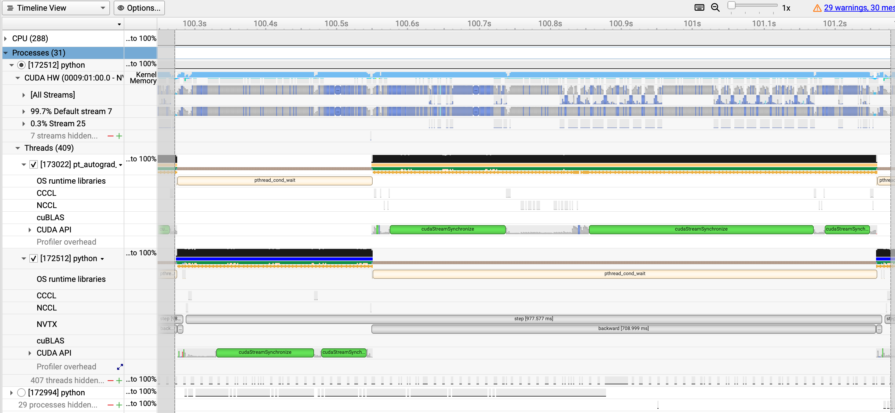
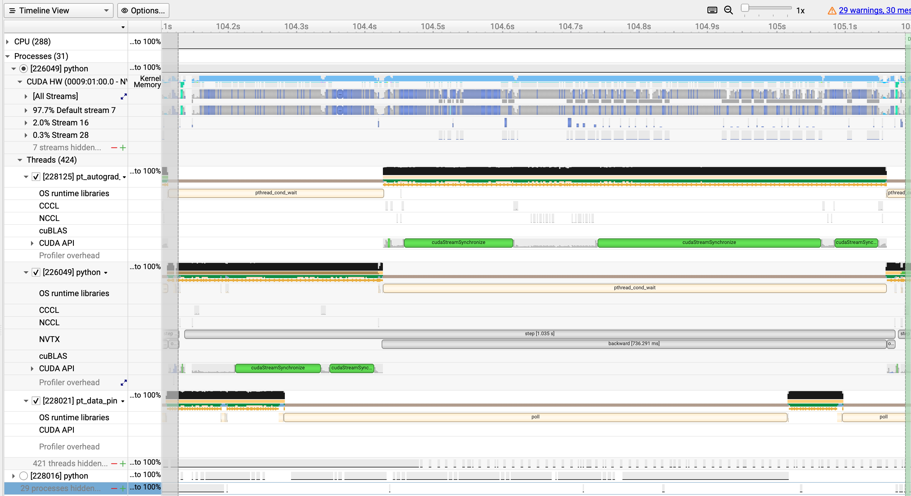

# Scaling Anemoi Training and Fine-Tuning on Isambard-AI

## Introduction

> [!IMPORTANT]
> Introduction section is empty. Should cover: motivation for the work, a brief description of Anemoi and Isambard-AI, the research questions being investigated, and a summary of the structure of the report.

## Initial Scaling Tests

### O96 Strong Scaling

We start with baseline experiments to understand how Anemoi scales with different node counts on Isambard-AI. We chose the `O96` setup for these tests, with the results depicted in the following graph. We pretrained the Anemoi model for 2 epochs varying node counts 1, 10, 50, 100, 200, and 500.

We measured both the wall-clock time (`Slurm Total Time`) and the total computational cost (`Total Node Hours`) against an increasing number of nodes and plotted them on a log-log scale to capture the strong scaling behaviour in the graph below.


Observations:

- The results in the graph reveal a pattern of initial performance gains followed by diminishing returns and eventual performance degradation due to overheads. While the wall-clock time provides a measure of speed, the `Total Node Hours` offers critical insight into the efficiency and overall cost of the computation. This metric, representing the product of the number of nodes and the job duration, shows a continuous upward trend across the entire experiment.

- Scaling from a single node to 100 nodes yields a significant reduction in total time, demonstrating the effectiveness of parallelisation in this range. However, beyond this 100-node peak, the trend reverses, and the `Slurm Total Time` begins to increase. This indicates that the time spent on inter-node communication, data synchronization, and other parallel overheads starts to outweigh the benefits of additional computational power.

- Even in the range where the wall-clock time is decreasing (1 to 100 nodes), the total node hours increase, signifying that each incremental speedup comes at a higher total computational cost. After the 100-node mark, this inefficiency becomes particularly pronounced, with the `Total Node Hours` rising sharply. This confirms that the additional nodes are contributing more to system overhead than to useful work, making any scaling beyond 100 nodes not only slower but also substantially more resource-intensive and cost-ineffective.

In addition to the strong scaling analysis, we also looked into the total job time breakdown, by separating the actual training time from the setup time. The following plot illustrates this breakdown:


Observations:

- The data reveals a clear trade-off between parallelising the workload and the overhead required to manage it. As the number of nodes increases from 1 to 100, the Job Training Time (blue line) drops significantly, from 4,189 seconds to a minimum of 82 seconds, demonstrating effective strong scaling.

- In contrast, the Training Setup Time (red line) exhibits a continuous and dramatic increase with each addition of nodes, starting at just 23 seconds and ballooning to 1000 seconds on 500 nodes. This opposing trend highlights that while distributing the training task speeds up computation, the initialisation phase becomes progressively more burdensome.

- The scaling efficiency fundamentally breaks down beyond the 100-node mark. At 200 nodes, the Training Setup Time (275s) is already more than double the Job Training Time (117s), indicating that the system spends far more time preparing for the job than actually executing it. This inefficiency culminates at the 500-node test, where the setup time is nearly eight times longer than the training time. This crossover point demonstrates a critical bottleneck in the workflow, where the cost of coordinating a large number of nodes completely negates the computational benefits, leading to a net loss in overall performance.

### n320 Strong Scaling

Following the baseline tests with the `O96` dataset, we repeated the strong scaling experiments using the significantly higher resolution `n320` dataset. The `n320` configuration represents a much heavier computational workload per grid point, which theoretically allows for better parallelisation efficiency as there is more "useful work" to perform on each GPU relative to the communication overhead required between steps.

For these experiments, we trained the model for 2 epochs across a node range of 1, 2, 8, 10, 25, 50, 100, and 200 nodes. We haven't yet tested beyond 200 nodes for the `n320` setup due to resource constraints and the already observed trends from the `O96` tests. As with the previous tests, we tracked both the wall-clock time to assess speedup and the total node hours to evaluate the computational cost efficiency.


Observations:

- Improved Scaling Range: Compared to the `O96` experiments, the `n320` workload scales effectively over a wider range of resources. The Slurm Total Time decreases near-linearly from 33,444 seconds (~9.3 hours) on a single node down to 669 seconds on 100 nodes. This indicates that the heavier computational load of the `n320` dataset more effectively utilises the available GPU compute power up to this point.

- Diminishing Returns at 200 Nodes: The transition from 100 to 200 nodes yields a negligible reduction in wall-clock time (669s to 642s), suggesting a hard scalability limit has been reached. However, the cost penalty is severe: the Total Node Hours nearly doubles from 18.58 hours to 35.67 hours. This confirms that while 100 nodes offer a fast and relatively efficient runtime, pushing to 200 nodes provides almost no speed benefit while drastically increasing resource consumption.
- Cost Stability: Unlike the lighter `O96` workload, where cost increased immediately, the `n320` setup maintains relatively stable cost efficiency up to 25 nodes (rising only from 9.29h to 13.49h). This suggests the system is well-optimized for this resolution at low-to-medium cluster sizes.

To better understand the plateau observed at 200 nodes, we again decomposed the total job time into actual training time versus setup time.


Observations:

- Heavier Workload Masks Overhead: The Job Training Time (blue line) reduces smoothly from 33,384 seconds on 1 node to 312 seconds on 200 nodes. Because the `n320` model requires more computation per step than `O96`, the training phase remains dominant over the setup phase for much longer.
- Convergence at 200 Nodes: While the Training Setup Time (red line) increases exponentially with node count—rising from 32s to 289s, it does not completely overtake the training time as seen in the `O96` tests. At 200 nodes, the training time (312s) and setup time (289s) are nearly roughly equal.
- The Overhead Bottleneck: Although setup time has not eclipsed training time, it has become a significant fraction of the total job duration at 200 nodes (accounting for nearly 50% of the active job time). This explains the plateau in the previous scaling plot: even though the GPUs are calculating gradients faster, the time spent initialising the distributed environment prevents any meaningful reduction in total wall-clock time.

# Profiling and benchmarking Anemoi Training

## Initial multinode profiling results

To gain deeper insights into the performance bottlenecks observed during the scaling tests, we coducted a series of profiling experiments. These profiles aimed to dissect the training process, identifying which components contributed most to the overall execution time and how these contributions changed with varying node counts.

### Simple Profiling

We began with a straightforward profiling approach, by utilising anemoi's built-in profiling capabilities and a `simple` profiling configuration which reports high-level benchmarking and timing information. We ran these profiles on the `O96` dataset across a range of node counts: 1, 10, 50, with each run training for 1000, 100, and 20 steps respectively to keep the total training amount of work roughly consistent between tests.

| Metric | 1 Node (1000 steps) | 10 Nodes (100 steps) | 50 Nodes (20 steps) | Comment |
| :--- | :--- | :--- | :--- | :--- |
| **Avg Batch Time** (s) | 1.01 | 1.23 | 1.58 | ❌ **Increasing** |
| **Forward Pass** (`training_step`) (s) | 0.27 | 0.35 | 0.48 | ❌ **Increasing** |
| **Backward Pass** (`backward`) (s) | 0.73 | 0.77 | 0.78 | ✅ No Bottleneck |
| **Training Throughput** (batches/s) | 0.97 | 0.76 | 0.54 | ❌ **Decreasing** |
| **Data Loading Throughput** | 780 | 301 | 7,891 | ✅ No Bottleneck |
| **Validation Throughput** | 1.47 | 1.95 | 4.65 | ✅ No Bottleneck |

Observations:

- The most critical observation is that training speed decreases as node count increases. Instead of speeding up, the system takes longer to process a single batch as you scale from 1 to 50 nodes (1.01s to 1.58s).

This indicates network communication overhead. The cost of synchronising gradients (All-Reduce) and managing the distributed group strategy outweighs the compute power added by the extra nodes.

The `optimizer_step` accounts for nearly 100% of the batch time in all configurations, suggesting the system is blocking while waiting for gradient synchronisation across the distributed workers.

- While the Backward pass (`backward`) times remained relatively stable (0.73s to 0.78s), the Forward pass (`training_step`) degraded significantly, taking nearly twice as long on 50 nodes (0.48s) compared to 1 node (0.27s).

This suggests that the distributed strategy (DDPGroupStrategy) introduces significant overhead even during the forward pass, likely due to broadcast operations or synchronisation barriers required before computation can begin.

- The Data Loading Throughput is consistently orders of magnitude higher than the training throughput (e.g., 7,891 vs 0.54 on 50 nodes). The model is compute/network bound, not I/O bound.

- Unlike training, validation throughput increases with node count (1.46 to 4.65). This is somewhat expected behaviour, as validation typically requires less frequent communication (synchronisation often happens only at the end of the epoch), allowing the system to utilise the parallel compute of 50 nodes effectively for inference.

### NCCL Benchmarking

To further investigate the communication overheads identified in the profiling step, we conducted NCCL benchmarking tests using the NCCL tests suite. These benchmarks help us understand the performance characteristics of the underlying communication library (NCCL) used for synchronising gradients across multiple GPUs in a distributed training setup.

The NCCL `All-Reduce` test is a synthetic benchmark designed to measure the raw communication speed of the All-Reduce operation, which is the critical synchronisation step used in distributed deep learning to average gradients across all GPUs. By performing this specific collective operation repeatedly on dummy data, the test isolates the performance of the physical interconnects, such as NVLink for intra-node communication and Slingshot or InfiniBand for inter-node traffic, stripping away any overhead from the deep learning framework (like PyTorch) or data loading pipelines. This makes it the definitive diagnostic tool for determining whether training bottlenecks are caused by physical network limitations (infrastructure) or software inefficiencies, as it provides a clear "speed limit" (Bus Bandwidth) that the hardware can support.

We have carried out the NCCL All-Reduce benchmarks on Isambard-AI across varying node counts: 1, 10, 50, and 200 nodes. Each test was executed using the `job_nccl_test.sh` script, which submits the benchmark job to the Slurm scheduler with the specified number of nodes.

| Nodes | Total GPUs | Peak Bus Bandwidth (GB/s) | Scaling Efficiency |
| :--- | :--- | :--- | :--- |
| **1** | 4 | **342.5** | Baseline (NVLink) |
| **10** | 40 | **92.7** | Excellent (Slingshot) |
| **50** | 200 | **91.2** | Excellent (Slingshot) |
| **200** | 800 | **70.8** | Good (~23% drop) |

Key observation: network is not the bottleneck: The bandwidth remains stable between 10 nodes (92.7 GB/s) and 50 nodes (91.2 GB/s). This suggests that the "negative scaling" seen in the training runs is **not** caused by network congestion or hardware limits.

> [!IMPORTANT]
> Missing: a connecting sentence explaining what the NCCL result implies for the investigation. If the hardware network is not the bottleneck, the source of the multi-node overhead must lie in the software layer — the distributed training framework, the DDPGroupStrategy, or synchronisation barriers within the model. This should be stated explicitly here, and should motivate the transition to single-GPU profiling in the next section.

## Single GPU

### Baseline Profiling

<!-- 
 simple:
 /home/u5gd/tomas.u5gd/u5gd_shared/tomas/anemoi_workspace/experiments/2_O96/5_1gpu_profiling/1_baseline/simple

 detailed:
 /home/u5gd/tomas.u5gd/u5gd_shared/tomas/anemoi_workspace/experiments/2_O96/5_1gpu_profiling/1_baseline/detailed
 -->

We began with a baseline profiling run using the `simple` and `detailed` anemoi profiling configurations on a single NVIDIA GH200 GPU using the O96 dataset for 40 training steps.

Throughout this report, **Avg Batch Time** is taken from the `run_training_batch` timer in the Anemoi profiler output. This timer wraps each individual training step — the forward pass, backward pass, and optimizer update — and excludes inter-step overhead such as dataloader fetching, validation, and Lightning framework bookkeeping. It is the most precise measure of raw training performance and is used consistently for all comparisons.

**Training Throughput** (samples/s) is derived from the Anemoi profiler's `training_avg_throughput` metric, multiplied by the per-GPU batch size: `samples/s = training_avg_throughput × batch_size`. Unlike `run_training_batch`, `training_avg_throughput` is a wall-clock rate measured over the full training loop and therefore includes inter-step overhead such as dataloader fetching and Lightning bookkeeping. It gives a slightly lower (more conservative) throughput figure than dividing total samples by `run_training_batch` time alone, and better reflects the end-to-end training speed experienced in practice. The default batch size is 8, so `samples/s` is 8× the `training_avg_throughput` (batches/s).

The time profiler output shows the following key metrics:

| Metric | Simple Profile | Detailed Profile | Delta (Time) | Delta (%) |
| :--- | :--- | :--- | :--- | :--- |
| **Total Epoch (40 steps) Time** | **39.22 s** | **43.35 s** | +4.13 s | +10.5% |
| **Avg Batch Time** | 0.97 s | 1.06 s | +0.09 s | +8.8% |
| **Training Throughput** | 7.93 samples/s | 7.01 samples/s | −0.92 samples/s | −11.6% |
| **Backward Pass** (Total) | 28.27 s | 28.39 s | +0.12 s | +0.4% |
| **Forward Pass** (Total) | 10.18 s | 10.37 s | +0.19 s | +1.9% |
| **Optimizer Step** (Total) | 38.80 s | 42.20 s | **+3.40 s** | +8.8% |
| **DataLoader Next** (Total) | 0.11 s | 0.30 s | +0.19 s | **+160%** |

1.  **Profiling Overhead is Significant (~10%):**
    The "Detailed" configuration adds over 4 seconds of overhead to the epoch. It is not "free" and distorts the total runtime metrics, making the code appear slower than it actually is.

2.  **Overhead Concentrated in Optimizer Logic:**
    The GPU-heavy operations (Forward/Backward) are barely affected (<2% difference). The massive jump in `optimizer_step` time (from 38.8s to 42.2s) suggests the detailed profiler is hooking into CPU-side Python loops, likely instrumenting individual parameter updates or gradient checks, rather than slowing down the CUDA kernels.

3.  **Backward Pass Dominates Compute:**
    Regardless of the profile mode, the **Backward Pass** consumes ~72% of the training time (28.27s vs 10.18s for Forward). This ~2.8:1 ratio is the primary bottleneck and suggests the model might be using Activation Checkpointing (trading compute for memory) or has expensive gradient calculations. This is consistent with the Anemoi architecture, which uses `num_chunks: 2` for activation checkpointing, adding approximately one extra forward pass of compute to the backward pass (~50% increase over the standard 2× forward cost), bringing the total backward compute to ~3× the forward — consistent with the observed 2.8:1 ratio.

4.  **DataLoader Impact:**
    While the absolute time is small, the "Detailed" profiler causes the data loading time (`train_dataloader_next`) to nearly triple (+160%). This confirms that detailed profiling heavily impacts lightweight Python iterator operations.


The model summary from the detailed profiler shows the following key metrics:

| Metric | Value | Interpretation |
| :--- | :--- | :--- |
| **Model Size** | **231 M** Params (462 MB) | **Small** |
| **Compute Load** | **23.42** Tera-Multiply-Accumulate or **46.84** Tera-Floating Point operations | **Extremely** high compute density per parameter due to large input grid. |
| **Forward/Backward Pass Size** | **95.1** GB (theoretical) | **Critical.** Theoretical activation memory estimated by the model profiler. Actual measured peak is 34.1 GB with `num_chunks: 2` activation checkpointing; without it (`num_chunks: 1`) peak is 61 GB. Activation Checkpointing is therefore required to fit within the GH200's 96 GB HBM3e. |
| **Architecture** | Graph Transformer | Encoder-Processor-Decoder structure. |
| **Scale** | 322k / 87k Nodes | Grid inputs vs. Latent processor nodes. |

1.  The model weights are only 462 MB, while the theoretical forward/backward pass size is 95.1 GB. Despite being a small model by parameter count, the graph-based architecture with 40,320 input nodes generates disproportionately large activations, theoretically requiring approximately 205 bytes of activation memory per byte of model parameters. Activation Checkpointing reduces actual peak usage to 34.1 GB at runtime.

2. The model summary shows 23.42 Tera-operations (Mult-Adds) per pass. For a 231M parameter model, this is an extremely high ratio of compute-to-parameters, caused by the large number of nodes (40,320) and the Graph Transformer's edge-based operations.

3. Assuming 23.42 Tera-MACs for the Forward pass, and that the standard Backward pass requires double the compute (for weight and input gradients), the baseline computational cost is 3x the Forward pass. However, since `num_chunks` is set to 2, the model utilises activation checkpointing, which forces an additional re-computation of the forward pass during backpropagation.
This brings the total hardware load to the equivalent of **4** full forward passes per step. Therefore, the realised FLOPs per step are: 4 x 23.42 Tera-MACs x 2 FLOPs/MAC = **187.4 TFLOPs**.
Using the Average Batch Time of 0.97s (simple profile) and 1.06s (detailed profile), we derive a compute throughput of approximately **193 TFLOP/s** and 176 TFLOP/s respectively. The GH200's BF16 Tensor Core peak is quoted in two ways: **989 TFLOP/s (dense)** and **1,979 TFLOP/s (sparse, with structured sparsity enabled)**. Since this model does not use structured sparsity, the dense figure is the correct baseline. Comparing against 989 TFLOP/s, **we are achieving roughly ~20% of theoretical peak performance**, which is consistent with a memory-bound workload. The sparse figure would give a misleadingly low ~10%, as the hardware cannot exploit that headroom without explicit sparsity support in the model.


The **detailed** profiler also provides a TensorBoard trace which provides additional profiling information.

#### TensorBoard trace: GPU and Execution Summary

From the **GPU and Execution Summary** sections of the trace, we extract the following key metrics:

```
GPU Utilization: 92.81%
Est. SM Efficiency: 90.84%
Est. Achieved Occupancy 41.92 %
Average Step Time: 1,290,933 us
```

- GPU Utilisation of 92.81% indicates that the GPU is busy executing work for the vast majority of the training step. This rules out data loading starvation or CPU-side Python lag as the primary bottlenecks. The GPU is the constraint.
- Est. SM Efficiency of 90.84% indicates that Streaming Multiprocessors (SMs) have at least one active warp most of the time they are scheduled. This does not mean that all SMs are doing calculations, just that they are active, for example they could be waiting for memory.
- Est. Achieved Occupancy of 41.92% indicates that less than half of the theoretical maximum number of warps are active on the SMs at any given time. This suggests that there are limitations, such as registers, shared memory, or memory stalls preventing higher occupancy.
- The TensorBoard step time of 1.29 s is best understood as the outermost layer of a stack of progressively wider measurements, each adding more overhead:

  | Measure | Step Time | What it includes |
  | :--- | :--- | :--- |
  | `run_training_batch` (simple) | 0.97 s | Core forward/backward/optimizer only |
  | `run_training_batch` (detailed) | 1.06 s | + detailed profiler instrumentation |
  | `1 / training_avg_throughput` (detailed) | 1.14 s | + inter-step overhead (dataloader, Lightning bookkeeping) |
  | TensorBoard step time | 1.29 s | + TensorBoard trace capture overhead |

  None of these are directly interchangeable; each measures a different scope of work.

This indicates that the GPU is being well utilised, but there are bottlenecks preventing it from reaching higher occupancy, which usually points to memory bandwidth limitations.

#### TensorBoard trace: Memory View

If we look at the **Memory View** of the trace, we can see the following:

Peak Memory Usage: 34.1 GB
The "Sawtooth" Pattern (Allocated vs. Time)

- We are currently utilising only ~36% of the available 95.0GB VRAM capacity. The usage is not static, iIt follows a "Sawtooth" pattern—rapidly spiking to 34GB and dropping.
- This is the visual signature of Gradient/Activation Checkpointing `(num_chunks: 2`). The model processes a "chunk" of data, computes activations, calculates gradients, and then immediately frees that memory before moving to the next chunk. This prevents the memory from accumulating to the theoretical ~93 GB we calculated earlier. It successfully keeps the peak low (34 GB).

In the Anemoi architecture, the `num_chunks` parameter is the primary mechanism for `Activation Checkpointing`. It works by dividing the number of layers of the `TransformerProcessor` into a specified number of segments, and then for each segment, the model discards intermediate activations during the forward pass to save GPU memory and re-calculates them "on the fly" during the backward pass. Setting num_chunks: 16 means the model checkpoints every single layer (maximum memory saving, maximum compute penalty), while num_chunks: 1 disables checkpointing entirely (maximum memory usage, minimum compute penalty).

> [!WARNING]
> Removing Activation Checkpointing (setting `num_chunks: 1`), makes the peak memory usage jump to 61GB, but the step time remains roughly the same (1.05s vs 1.06s). Going in the other direction, increasing checkpointing to `num_chunks: 16` reduces peak memory to 33GB, but changes memory usage pattern, where the peak memory usage appears only once at the start of the step, and then remains at much lower levels for the rest of the step. This is because with `num_chunks: 16`, the model processes each layer individually, freeing memory immediately after each layer's backward pass, rather than waiting until the end of the entire forward pass.
> **This indicates that while activation checkpointing effectively manages memory usage, it does not significantly impact the overall training speed for this model configuration, as the bottleneck lies elsewhere**.

This headroom motivated doubling the batch size from 8 to 16, explored in Action 1. Simple profiling shows a negligible −1.8% change (7.93 -> 7.79 samples/s), while detailed profiling shows +10% (7.01 -> 7.71 samples/s) — the latter is inflated because the detailed profiler's fixed overhead is relatively smaller for larger batches, making BS16 appear more efficient than it is. The simple profiler result is more representative: doubling the batch size provides no meaningful throughput gain, confirming the GPU was already partially saturated at batch 8 and the bottleneck lies in compute rather than memory capacity.

#### TensorBoard trace: Operator View

The Operator View measures the time the Manager (CPU) spends issuing instructions to the GPU. It tells if the CPU is efficient or if it is stalled.

In our case, we see that `Host Self Time` is dominated by `aten::copy_` (58.5%) and `aten::nonzero` (26.7%).

- The high cost of `aten::nonzero` suggests the model is using dynamic sparse indexing that forces the CPU to wait for the GPU. This breaks the pipelining necessary for high throughput.

The `Host Total Time` shows that `aten::index_put_impl_` (15.8%), `aten::to` (12.7%), `aten::_to_copy` (12.7%), and `aten::copy_` (12.3%) are the most time-consuming operations.

- The high volume of `aten::to` and `aten::copy_` calls suggests the model is performing tensor casts inside the training loop. These operations, along with the `aten::nonzero` synchronisation stalls, were subsequently addressed by applying `torch.compile` in Action 3, which fused over 50,000 such element-wise operations via Triton and eliminated the `cudaStreamSynchronize` bottleneck entirely (confirmed in Action 5).

#### TensorBoard trace: Kernel View

The Kernel View provides insights into the GPU kernel execution, showing which kernels are consuming the most time during training.

First of all, we check the `Tensor Cores Utilization` metric, `Not Using Tensor Cores`: 98.9% and `Using Tensor Cores`: 1.1%, indicating that The GPU spends 1% of the time doing the heavy calculations (MatMul/Attention) and 99% of the time moving data to prepare for those calculations. This is confirmation that the workload is **Memory Bandwidth Bound**.

This view also provides a breakdown of the time spent in various kernel types:

- The nvjet Kernels (NVIDIA's low-level GPU operations) dominate the execution time, accounting for 40-50% of the total kernel time.
- The flash Kernels (used for attention mechanisms) account for approximately 25% of the time.
- `flash_fwd_kernel` is called 2x more often than `flash_bwd_kernel`, this proves that `num_chunks: 2` activation checkpointing is active, as the forward pass needs to be re-computed during the backward pass.

### Hardware Efficiency

The previously identified four GPU efficiency metrics describe this memory-bound workload from different vantage points, and are mutually consistent:

| Metric | Value | What it measures |
| :--- | :--- | :--- |
| GPU Utilisation | 92.81% | Fraction of step time the GPU is executing *any* kernel — confirms no data starvation or CPU-side stalls. |
| Est. SM Efficiency | 90.84% | Fraction of scheduled SM time where at least one warp is active — confirms SMs are rarely idle. |
| Est. Achieved Occupancy | 41.92% | Fraction of the *theoretical maximum* number of concurrent warps that are actually active — less than half, indicating register or memory pressure limits warp parallelism. |
| Tensor Core Utilisation | ~1.1% | Fraction of kernel execution time spent in Tensor Core operations (dense MatMul/Attention) — 98.9% of GPU time is spent on memory-bound element-wise operations instead. |
| Model FLOP Utilisation (MFU) | ~20% | Achieved TFLOP/s (193) vs. GH200 dense BF16 peak (989 TFLOP/s) — only 20% of peak compute throughput, consistent with a memory-bandwidth bound regime. |

> [!IMPORTANT]
> These metrics are mutually consistent, not contradictory. High GPU utilisation (92.81%) confirms the GPU is never idle; low Tensor Core utilisation (~1.1%) explains why MFU is only ~20% — nearly all of that active time is spent on memory-bound element-wise kernels rather than the dense matrix operations that Tensor Cores accelerate. The GPU is working continuously, but on the wrong type of work to exploit peak compute throughput. The optimisation actions that follow target precisely this gap: reducing kernel fragmentation and memory movement to shift more execution time towards compute-intensive operations.


### Action 1: Batch Size Increase

As noted earlier, the current batch size of `8` only utilises ~36% of the available GPU memory (34.1 GB used out of 95.0 GB total). Given that the model is memory-bandwidth bound, increasing the batch size should help saturate the memory bus and improve GPU utilisation. We increased `dataloader.batch_size.training` from `8` to `16` and compared performance over 40 training steps using the `simple` and `detailed` profiling configuration.

`simple` profiling results:

| Metric | Batch Size 8 | Batch Size 16 | Change |
| :--- | :--- | :--- | :--- |
| **Avg Batch Time** | 0.97 s | 1.91 s | +1.97x |
| **Training Throughput** | **7.93 samples/s** | **7.79 samples/s** | **−1.8%** |

`detailed` profiling results:

| Metric | Batch Size 8 | Batch Size 16 | Change |
| :--- | :--- | :--- | :--- |
| **Avg Batch Time** | 1.06 s | 1.99 s | +1.88x (expected) |
| **Training Throughput** | **7.01 samples/s** | **7.71 samples/s** | **+10%** |
| **Peak Memory** | 34.1 GB (36%) | ~68 GB (~72%) | +2x |

Observations:

- The per-step time nearly doubled (1.88x under detailed profiling), which is expected — each step processes twice as many samples. The meaningful metric is throughput in **samples/s**. Simple profiling (more representative) shows a negligible **−1.8%** change (7.93 -> 7.79 samples/s); detailed profiling shows **+10%** (7.01 -> 7.71 samples/s). The +10% figure is inflated because the detailed profiler's fixed overhead is proportionally smaller for larger batches — the simple result is the more reliable indicator. For multi-GPU runs, throughput is further multiplied by the number of GPUs to give total throughput.

- Peak memory utilisation doubled from 36% to ~72% of the 95 GB available, confirming the roughly linear memory scaling with batch size. There is no evidence of memory-bound degradation in this range.

- The absence of a meaningful throughput gain (−1.8% under simple profiling) relative to the large increase in memory utilisation (+100%) confirms that the model was not starved of data at batch size 8. The GPU was already partially saturated, and doubling the batch size provided no real benefit. This is consistent with the finding that the bottleneck lies in the compute kernels rather than memory capacity.


### Action 2: Increase the number of workers in the DataLoader

<!-- 
8 workers:
/home/u5gd/tomas.u5gd/u5gd_shared/tomas/anemoi_workspace/experiments/2_O96/5_1gpu_profiling/3_batch_s/simple

16 workers:
/home/u5gd/tomas.u5gd/u5gd_shared/tomas/anemoi_workspace/experiments/2_O96/5_1gpu_profiling/4_dataloader/simple_bs16_16w

32 workers:
/home/u5gd/tomas.u5gd/u5gd_shared/tomas/anemoi_workspace/experiments/2_O96/5_1gpu_profiling/4_dataloader/simple_bs16_32w
 -->

Following the batch size increase, we tested whether data loading was a bottleneck by varying `dataloader.num_workers.training` across 8, 16, and 32 workers. All runs used batch size 16 and the `simple` profiling configuration over 40 training steps.

| Metric | 8 Workers | 16 Workers | 32 Workers |
| :--- | :--- | :--- | :--- |
| **Avg Batch Time** | 1.91 s | 1.92 s | 1.95 s |
| **Training Throughput** | 7.79 samples/s | 7.95 samples/s | 7.72 samples/s |
| **vs. 8 Workers** | Baseline | +2.1% | −0.8% |

Observations:

- All three configurations produce virtually identical throughput (7.72–7.95 samples/s), with a total spread of less than 3% — well within run-to-run noise. Neither increasing to 16 workers nor to 32 workers produced a meaningful improvement.

- The step time variation is similarly negligible (1.91–1.95 s), with 32 workers being marginally slower, likely due to thread scheduling overhead at higher worker counts.

- These results confirm that data loading is not the bottleneck. The DataLoader is already supplying batches faster than the GPU can consume them, which is consistent with the earlier observation that dataloader throughput (hundreds of samples/s) is orders of magnitude higher than training throughput (~8 samples/s). The limiting factor is entirely on the compute side.


### Action 3: Compile the model with `torch.compile`

<!--
baseline (eager) / simple
/home/u5gd/tomas.u5gd/u5gd_shared/tomas/anemoi_workspace/experiments/2_O96/5_1gpu_profiling/1_baseline/simple_200s

compiled / simple
/home/u5gd/tomas.u5gd/u5gd_shared/tomas/anemoi_workspace/experiments/2_O96/5_1gpu_profiling/5_compile/simple_200s
 -->

Model compilation via `torch.compile` is an optimisation process that transforms standard PyTorch code into high-performance machine code specifically tuned for the target hardware, in this case, NVIDIA's Grace Hopper GPUs. It works by capturing the model’s computational graph and applying "kernel fusion," a technique that merges multiple sequential operations, such as a Linear layer followed by a GELU activation and a LayerNorm, into a single execution step.

The PyTorch Compiler also analyses data dependencies and memory access patterns to rearrange operations in a way that maximises data locality and minimises memory bandwidth usage, fuses many small operations into larger kernels to reduce launch overhead.

Under the hood, The PyTorch Compiler uses TorchDynamo to trace the code, AOT Autograd to optimise gradient computations by capturing the forward and backward passes, and TorchInductor to generate the final code with Triton for GPU execution. This optimisation is powered by **Triton**, a domain-specific compiler and language that allows `torch.compile` to generate highly efficient CUDA kernels directly from Python. By using Triton, the model can keep intermediate data within the GPU's fast on-chip SRAM or L2 cache instead of constantly writing and reading activations from the 120GB HBM3 main memory.

Given the observations from the TensorBoard traces, specifically the high overhead of Python-level operations (`aten::to`, `aten::copy_`) and the memory-bound nature of the workload, we hypothesised that Just-In-Time (JIT) compilation using `torch.compile` would provide a speedup. The goal was to fuse element-wise kernels (reducing memory bandwidth pressure) and eliminate Python overhead. To isolate the effect of compilation from the batch size change in Action 1, these experiments were run at the original batch size of 8.

We compared the standard "eager" mode against `torch.compile` over 200 training steps using the Anemoi `simple` profiler.

| Metric | Eager Mode | Compiled | Change |
| :--- | :--- | :--- | :--- |
| **Avg Batch Time** | 0.98 s | 1.01 s | +3.8% (recompilation overhead) |
| **Backward Pass** | 0.710 s | 0.691 s | **−2.7%** |
| **Forward Pass** | 0.259 s | 0.315 s | *Inconclusive due to re-compilation noise* |
| **Validation Step** | 0.321 s | 3.813 s | **+1,087%** (recompilation overhead) |
| **Training Throughput** | 8.04 samples/s | 6.31 samples/s | **−22%** |
| **Total Wall Time** | 236 s | 274 s | **+16%** |

**Observations:**

1.  **Modest Gains in Backward Pass:** The compiler successfully optimised the backward pass, reducing the time by ~2.7%. This is consistent with Triton fusing element-wise activation gradient operations identified in the TensorBoard trace.
2.  **Limited Impact on Graph/Attention Layers:** The speedup is not drastic. This is expected because the Anemoi model relies heavily on `FlashAttention` and sparse graph operations. `FlashAttention` is already highly optimised; `torch.compile` cannot optimise it further. The compiler mostly cleaned up the code between these heavy layers.
3.  **Validation Step Recompilation:** The validation step degraded dramatically (0.321 s -> 3.813 s average over 6 calls). This is because `torch.compile` traces a separate computation graph for each new input shape or code path. When the training loop switches to validation mode, PyTorch encounters a new graph signature and triggers a full recompilation. With only 6 validation calls in the 200-step run, even 1–2 recompilation events dominate the average, resulting in a net negative outcome overall (−22% throughput, +16% wall time).
4.  **Net Result Over 200 Steps is Negative:** The recompilation overhead was not amortised within the 200-step window. This does not mean compilation is not beneficial — it means the warm-up cost is significant, particularly for the validation path. Over a full training run of thousands of steps the cost is amortised, and the steady-state per-step benefit is better captured by the detailed profiling below.
5.  It is possible to save the compiled artifacts across runs to reduce the compilation overhead on subsequent executions, however, this will be explored in future work.

### **Detailed Profiling: Eager vs. Compiled Mode**

<!-- 
baseline (eager) / detailed
tensorboard --logdir /home/u5gd/tomas.u5gd/u5gd_shared/tomas/anemoi_workspace/experiments/2_O96/5_1gpu_profiling/1_baseline/detailed/output/profiler/

compiled / detailed
tensorboard --logdir /home/u5gd/tomas.u5gd/u5gd_shared/tomas/anemoi_workspace/experiments/2_O96/5_1gpu_profiling/5_compile/detailed/output/profiler/
 -->

To isolate steady-state compiled performance from recompilation noise, we followed up with a detailed TensorBoard profiling run of 40 steps in both Eager and Compiled modes. Unlike the 200-step simple profiler run above — which was dominated by validation recompilation overhead — this run was designed to capture the stable, post-warmup execution profile.

*   **Execution Speed:** `torch.compile` reduced the average step time reported by TensorBoard trace: GPU and Execution Summary from **1.29s to 1.18s** (an 8.5% improvement). This gain was driven almost entirely by a **~117ms reduction** in raw kernel execution time.
*   **The Occupancy Trade-off:** We observed a counter-intuitive drop in GPU occupancy (41.9% $\to$ 37.1%), while GPU utilisation remained high throughout (92.81% $\to$ 91.75%). This is a characteristic of **Triton kernels**, which use more registers to keep data local to the compute units. By trading thread parallelism for data locality, the model reduces slow global memory round-trips, processing data faster despite having fewer active warps.
*   **Operator Fusion:** The Operator View confirms a dramatic reduction in element-wise operator calls. `aten::copy_` dropped from **6,750 -> 3,075** (−54%), `aten::empty_strided` from **6,765 -> 2,900** (−57%), and `aten::to` from **5,155 -> 1,535** (−70%). By fusing these thousands of small memory operations into a few "Compiled Regions," the CPU dispatch overhead was substantially reduced.
*   **Memory Efficiency:** Peak memory usage dropped by **10%** (34.2 GB $\to$ 30.7 GB). While the model still follows a "sawtooth" pattern due to activation checkpointing, the compiled version manages intermediate buffers more efficiently, providing more headroom for larger batch sizes.
*   **Hardware Bottlenecks:** Despite these gains, Tensor Core utilisation remained stagnant at **~1.2%**. This confirms that the model is strictly **memory-bandwidth bound**; the GPU spends the vast majority of its time moving data rather than performing dense math.

**Conclusion:**
`torch.compile` provides a measurable steady-state performance boost through kernel fusion — reducing per-step GPU execution time by ~8.5% and peak memory footprint by ~10%. The GPU was already highly utilised in eager mode (92.81%) and remained so after compilation (91.75%), confirming the GPU was not idle between kernel launches. The gain came from eliminating thousands of redundant small memory operations (`aten::copy_`, `aten::empty_strided`, `aten::to`), reducing total data movement and CPU dispatch overhead.

However, the short-run (200-step) simple profiler results tell a different story: overall throughput *dropped* by 22% and wall time *increased* by 16%. The culprit is recompilation overhead on the validation path — when the training loop switches to eval mode, `torch.compile` encounters a new graph signature and must retrace, inflating the average validation step from 0.321 s to 3.813 s over only 6 calls. This warm-up cost is a one-time expense per process; over a full training run of tens of thousands of steps it is fully amortised. Caching compiled artefacts across runs (via `torch._dynamo.config`) can eliminate this overhead entirely on subsequent executions.

Despite the steady-state gains, Tensor Core utilisation remained low (~1.2%) in both modes, confirming the model remains **memory-bandwidth bound**: the graph message-passing and attention kernels have insufficient arithmetic intensity to saturate the Tensor Cores regardless of compilation. Compilation made the memory-bound workload more efficient — fewer, larger kernels with better data locality — but did not change the fundamental character of the bottleneck.

### Action 4: FP8 Precision

<!-- 
BF16-mixed / simple
/home/u5gd/tomas.u5gd/u5gd_shared/tomas/anemoi_workspace/experiments/2_O96/6_1gpu_profiling/3_compile/simple_200

FP8 / simple
/home/u5gd/tomas.u5gd/u5gd_shared/tomas/anemoi_workspace/experiments/2_O96/6_1gpu_profiling/6_fp8/compiled/simple_200
 -->

The performance comparison between `FP8` and `BF16-mixed` precision was conducted on a single NVIDIA GH200 GPU over 200 training steps using the Anemoi simple profiler. Both runs used `torch.compile` (applied in Action 3) to ensure a fair comparison on an equal optimisation footing. The FP8 run used the NVIDIA Transformer Engine to leverage the Hopper architecture's specialised 8-bit Tensor Cores, which theoretically offer double the mathematical throughput and half the memory traffic compared to 16-bit formats.

| Metric | BF16 Mixed | FP8 (Transformer Engine) | Difference |
| :--- | :--- | :--- | :--- |
| **Avg Batch Time** | 1.026 s | **0.997 s** | FP8 is **2.8% faster** |
| **Forward Pass** | 0.314 s | 0.316 s | ~Equal |
| **Backward Pass** | 0.705 s | **0.676 s** | FP8 is **4.0% faster** |
| **Training Throughput** | 6.27 samples/s | **6.32 samples/s** | ~Equal (<1%) |
| **Dataloader Throughput** | **8,899 samples/s** | 1,426 samples/s | FP8 is **84% slower** |
| **Total Wall Time** | **264 s** | 273 s | FP8 is 3.4% slower |

At the GPU compute level, FP8 and BF16 perform virtually identically for this model. The backward pass is marginally faster with FP8 (−4%), consistent with reduced data movement from 8-bit weight representations, but the effect is too small to produce a meaningful difference in overall training throughput (<1%).

- **The memory-bandwidth wall persists:** The primary bottleneck remains the large data movement in the Graph Transformer. FP8's 8-bit Tensor Cores offer diminishing returns when the GPU is already limited by HBM3 bandwidth rather than arithmetic throughput, as confirmed by the ~1.2% Tensor Core utilisation in Action 3.
- **Severe CPU contention from AMAX scaling:** FP8 requires constant per-layer calculation of dynamic scaling factors (AMAX) on the CPU. This competes directly with the dataloader on the Grace CPU, collapsing dataloader throughput by **84%** (from 8,899 to 1,426 samples/s). Despite this, training throughput is unaffected because even at 1,426 samples/s the dataloader remains far faster than the GPU can consume batches (~6 samples/s needed at 0.790 steps/s × batch size 8).
- **Validation recompilation is similar in both runs:** Both BF16 and FP8 show elevated validation step times (~3.2–3.1 s vs expected ~0.3 s) for the same reason as in Action 3 — `torch.compile` retracing the validation graph on first entry.

**Conclusion:** For the Anemoi O96 model on GH200, FP8 and BF16 deliver essentially identical training throughput when both use `torch.compile`. FP8 does not provide a meaningful GPU compute advantage because the model is memory-bandwidth bound, not math-throughput bound. The main FP8 drawback is the CPU-side AMAX scaling overhead, which severely degrades dataloader throughput. BF16 mixed precision is recommended as the simpler, equally performant option for this model scale. FP8 may become advantageous for larger models with higher arithmetic intensity where the math-to-memory ratio is more favourable.

### Action 5: NVIDIA Nsight Systems (nsys) Profiling

While the PyTorch Profiler provides valuable insight into which parts of the training loop are slow, it cannot surface the underlying CPU-GPU synchronisation dynamics. NVIDIA Nsight Systems (nsys) provides a system-wide timeline of kernel launches, memory transfers, and CUDA API calls, making it the definitive tool for diagnosing whether a bottleneck is hardware-limited or software-imposed.

We profiled the model at three successive stages of optimisation. All nsys runs used the `simple` profiling configuration over 200 training steps to minimise profiling overhead while capturing a representative steady-state sample.

#### Phase 1: Baseline — CPU Dispatch Bottleneck

<!--  
/home/u5gd/tomas.u5gd/u5gd_shared/tomas/anemoi_workspace/experiments/2_O96/6_1gpu_profiling/2_baseline_nsys/simple_200
-->

Profiling the unmodified eager-mode model revealed a severe CPU-side bottleneck:

- The CPU dispatched **625,957 CUDA kernel launches** for just 200 steps (~3,130 kernels per step). This indicates the model consists of thousands of small, fragmented element-wise operations rather than fused compute kernels — consistent with the `aten::copy_` and `aten::nonzero` overhead identified in the earlier TensorBoard Operator View.
- `cudaStreamSynchronize` accounted for **91% of total CUDA API time** (~147 seconds). The CPU was repeatedly stopping and waiting for the GPU to acknowledge each batch of micro-kernels, preventing continuous work from being streamed ahead.
- GPU compute was dominated by `unrolled_elementwise_kernel` operations, confirming the kernel fragmentation seen in the TensorBoard Kernel View.

Note that GPU utilisation remained high at **92.81%** throughout — the GPU was not starved and was doing useful work. The inefficiency was on the CPU side: spending 91% of its CUDA API time on synchronisation bookkeeping rather than queuing work ahead. The fragmentation into ~3,130 micro-kernels per step added significant per-step CPU latency and prevented efficient pipelining.

#### Phase 2: torch.compile — Kernel Fusion

<!-- 
/home/u5gd/tomas.u5gd/u5gd_shared/tomas/anemoi_workspace/experiments/2_O96/6_1gpu_profiling/4_compile_nsys/simple_200
 -->

We profiled the model compiled via `torch.compile`. During this phase, compiling the full Lightning module caused the validation loop to crash with a misleading *"Triton installation not found"* error. The root cause was PyTorch Lightning's dynamic validation hooks breaking the static graph requirements of CUDA Graphs.

**Fix:** Rather than compiling the full Lightning wrapper, we compiled only the inner mathematical core:
```python
model.model = torch.compile(model.model)
```
This scopes compilation to the compute-heavy layers while leaving Lightning's control flow untouched.

The nsys profile after this fix showed dramatic improvement:

| Metric | Baseline (Eager) | Compiled | Change |
| :--- | :--- | :--- | :--- |
| **cudaLaunchKernel calls** | 625,957 | ~429,000 | **−31% (−196k)** |
| **Fused element-wise ops** | ~0 | >50,000 | Triton fusion active |
| **D2D Memory Movement** | 398 GB | 1.2 TB | +3x (expected) |
| **cudaStreamSynchronize share** | ~91% | Negligible | Bottleneck eliminated |

The tripling of Device-to-Device (D2D) memory movement is expected and intentional. Triton kernels use the GH200's 4 TB/s HBM3 bandwidth to allocate temporary workspace buffers, trading memory bandwidth for compute locality. This is the correct strategy for Hopper architectures where on-chip SRAM is limited but memory bandwidth is exceptionally high.

#### Phase 3: Hardware-Specific Math Tuning

<!--  
/home/u5gd/tomas.u5gd/u5gd_shared/tomas/anemoi_workspace/experiments/2_O96/6_1gpu_profiling/5_compile_changes_nsys
-->

With the CPU overhead eliminated, we tested a further round of hardware-level tuning, i.e. enabling the Fused AdamW optimizer.

| Metric | Compiled (BF16) | Fused AdamW | Change |
| :--- | :--- | :--- | :--- |
| **Avg Batch Time** | 1.026 s | 1.028 s | +0.1% |
| **Training Throughput** | 6.27 samples/s | 6.18 samples/s | −1.3% |

**Result: no improvement.** Avg batch time and training throughput are statistically unchanged (within noise).

This confirms that the optimizer step is not a meaningful bottleneck. The wall-clock time is entirely dominated by the forward and backward compute kernels (`nvjet_hsh`, FlashAttention, graph indexing), which are so large that shaving a few milliseconds off the weight update has no measurable impact on total step time.

#### Single GPU Hardware Saturation

Following the compilation fix, all software bottlenecks have been eliminated. There are no CPU dispatch stalls, no implicit synchronisation overhead, and no D2H transfer bottlenecks — the GPU is continuously engaged in kernel execution. The remaining hardware ceiling is HBM3 memory bandwidth, as confirmed by the ~1.2% Tensor Core utilisation in Action 3. The ~150-second runtime for 200 steps is distributed across the following categories:

| Workload | Share | Time (~) | Description |
| :--- | :--- | :--- | :--- |
| **Custom domain kernels** (`nvjet_hsh`) | ~36% | ~54 s | Spherical harmonics and graph message-passing |
| **FlashAttention** (fwd + bwd) | ~21% | ~32 s | Transformer attention layers |
| **Graph/mesh indexing** (`indexSelectLargeIndex`) | ~13% | ~20 s | Sparse routing between geographic mesh nodes |
| **D2H memory transfers** | <1% | ~1 s | No implicit synchronisation stalls |

The dominance of `nvjet_hsh` kernels confirms that Anemoi's performance profile is driven by its domain-specific physics operations rather than by the generic transformer components. `flash_fwd_kernel` is called 2x more often than `flash_bwd_kernel`, consistent with `num_chunks: 2` activation checkpointing re-computing the forward pass during backpropagation.

The `nvjet` kernel share here (~36%) differs from the 40–50% reported in the TensorBoard Kernel View in the Baseline Profiling section. These figures are not directly comparable: the TensorBoard trace was captured in eager mode, while this nsys breakdown reflects the compiled run. Compilation fuses and eliminates thousands of small element-wise operations, changing the relative weight of the remaining kernels — the `nvjet` share appears lower simply because it is now measured against a leaner total.

**Conclusion:** The single-GPU training pipeline has no remaining software bottlenecks. CPU dispatch overhead and synchronisation stalls have been eliminated, and the GPU is continuously engaged in kernel execution with no idle time. The remaining performance ceiling is the HBM3 memory bandwidth: the model's graph and attention kernels are memory-bandwidth bound at the hardware level, a characteristic of the problem's arithmetic intensity rather than a software inefficiency. This provides a clean, optimised baseline for the next phase: multi-node distributed scaling.

### Single GPU Summary

The table below summarises the cumulative effect of the single-GPU optimisation steps on the Grace Hopper (GH200) architecture. Step times in the main optimisation path (rows 1, 3, 4, 5) are from nsys at batch size 8 without the Anemoi profiling wrapper, which explains the lower baseline step time (~0.77 s) compared to the 0.97 s reported in the Baseline Profiling section. The FP8 branch row uses Anemoi simple profiler times (batch size 8, compiled) for direct comparison with Action 4 data. Peak VRAM reflects values from TensorBoard profiler runs where available.

> **Profiling note:** *Avg Batch Time* and *Training Throughput* are taken from the `simple` profiler (Anemoi's lightweight timer). *Peak Memory* is taken from the `detailed` profiler (PyTorch TensorBoard profiler / nsys). Both are used because memory statistics are only available under `detailed` profiling, but `detailed` profiling itself adds significant overhead — it serialises kernel launches and inflates step times, so it does not represent real training performance. `simple` profiling imposes negligible overhead and is therefore used for all timing and throughput figures.

| Configuration | Avg Batch Time (s) | Training Throughput (samples/s) | Peak Memory | Notes |
| :--- | :--- | :--- | :--- | :--- |
| **Baseline (eager, batch 8)** | 0.97 | 7.93 | 34.1 GB (36%) | High CPU overhead; 625k kernel launches (~3,130/step); heavy element-wise fragmentation. |
| **+ Batch size 16** | 1.91 | 7.79 (-1.8%) | ~68 GB (72%) | Step time doubles as expected (2× data/step). Negligible throughput decrease (−1.8%) despite 2× memory utilisation confirms the bottleneck is not data starvation. |
| **+ `torch.compile(model.model)`** | 1.01 (+3.8%) | 6.31 (−22%) | 30.7 GB | ~8.8% steady-state step time reduction (TensorBoard, 40 steps). Net −22% throughput over 200-step run due to validation recompilation overhead (amortised over full training). Fused `aten::copy_` (−54%), `aten::empty_strided` (−57%), `aten::to` (−70%). Memory reduced by 10%. |
| *↳ Alternative: FP8 (Transformer Engine)* | *1.00 s (+2.8%)* | *6.32 samples/s (−20%)* | *—* | *Training throughput identical to BF16 compiled (<1% difference). CPU contention from AMAX scaling collapses dataloader throughput by 84% (8,899 -> 1,426 samples/s). BF16 chosen as simpler, equally performant option.* |
| **+ Fused AdamW** | 1.03 s (+6.0%) | 6.18 samples/s (−22%) | N/A | No additional speedup. Optimizer step is not the bottleneck; runtime is dominated by forward/backward compute kernels. |


### Next Steps

The nsys breakdown identified two remaining cost centres that were not addressed in this work and represent the most promising targets for further single-GPU optimisation:

- **Investigate `indexSelectLargeIndex` (graph/mesh indexing):** At ~13% of total runtime, the sparse routing between geographic mesh nodes is the third-largest cost. Pre-computing and caching graph indices rather than re-indexing each step could reduce this overhead without changing model behaviour.

- **Investigate `nvjet_hsh` kernels:** These custom spherical harmonics or message-passing kernels account for ~36% of runtime. Understanding whether they originate from `anemoi-graphs` or a third-party library, and whether more recent or architecture-specific versions exist, is worth investigating.

## Single Node Multi-GPU Scaling

Each Isambard-AI node hosts **4 GH200 GPUs** connected via NVLink. Moving from 1 to 4 GPUs introduces the first layer of distributed communication: intra-node NCCL `all_reduce` over NVLink, which synchronises gradients across GPUs at the end of each backward pass. 

This section characterises how much overhead that communication adds, whether it can be hidden within computation, and establishes a clean intra-node baseline before introducing the far slower inter-node Slingshot network.

The single-GPU profiling in the previous section is the direct reference point for all measurements here. The consistent 1-GPU baseline (Anemoi simple profiler, batch 8, 200 steps) is **~0.96 s per step** (8.2 samples/s); this is reproduced across multiple nodes, confirming hardware uniformity.

### Action 1: Establish 4-GPU Throughput Baseline

<!-- 
1 gpu baseline 200 steps / simple
/home/u5gd/tomas.u5gd/u5gd_shared/tomas/anemoi_workspace/experiments/2_O96/6_1gpu_profiling/1_baseline/simple_200

4 gpu baseline 200 steps / simple
/home/u5gd/tomas.u5gd/u5gd_shared/tomas/anemoi_workspace/experiments/2_O96/7_1node_profiling/1_baseline/simple_200
 -->

We have run the same configuration as the single-GPU baseline using the Anemoi simple profiler over 200 steps. The key metric is **scaling efficiency**:

$$\text{Scaling efficiency} = \frac{\text{4-GPU total throughput}}{4 \times \text{1-GPU throughput}} \times 100\%$$

An efficiency below 95% at 4 GPUs — where NVLink bandwidth is very high and all communication is intra-node — would indicate a fundamental problem (e.g., synchronisation stalls, load imbalance, or incorrect DDP configuration) that would compound severely at larger scales.

**Connection to 1-GPU work:** The single GPU established 8.23 samples/s at batch 8 (200-step simple run). At 4 GPUs, strong scaling should yield close to 32.9 samples/s total. Step time should remain near 0.95 s if NVLink all-reduce overlaps fully with computation.

**Results:**

| Metric | 1 GPU | 4 GPUs (1 node) | Change |
| :--- | :--- | :--- | :--- |
| **Avg Batch Time** | 0.97 s | 1.22 s | +28% |
| **Throughput (per GPU)** | 8.23 samples/s | 6.30 samples/s | −23% |
| **Throughput (total)** | 8.23 samples/s | 25.20 samples/s | +3.06× |
| **Scaling Efficiency** | 100% | **76.5%** | — |

The scaling efficiency of 76.5% is well below the 95% threshold expected for intra-node NVLink communication. The source of this overhead is investigated in Action 2.

### Action 2: NVLink and NCCL Communication Overlap (nsys)

<!-- 
nsys:
/home/u5gd/tomas.u5gd/u5gd_shared/tomas/anemoi_workspace/experiments/2_O96/7_1node_profiling/2_bseline_nsys/simple_200

nvtx:
/home/u5gd/tomas.u5gd/u5gd_shared/tomas/anemoi_workspace/experiments/2_O96/7_1node_profiling/2_bseline_nsys/simple_200_nvtx

nsys compiled:
/home/u5gd/tomas.u5gd/u5gd_shared/tomas/anemoi_workspace/experiments/2_O96/7_1node_profiling/3_compile/simple_200
 -->

**Goal:** Profile the 4-GPU run with nsys to determine whether NCCL `all_reduce` operations run concurrently with the backward pass or serialise after it.

In DDP, PyTorch can overlap gradient communication with the backward pass: as soon as a parameter group's gradients are ready, NCCL begins the all-reduce for that bucket while the remaining backward computation continues. If this overlap is successful, the communication cost is fully hidden and single-GPU step time is preserved. If not, all-reduce appears as a sequential stall after the backward kernel completes.

Key metrics to extract from the nsys timeline:
- **All-reduce duration** vs backward pass duration — does all-reduce fit inside the backward window?
- **NVLink bandwidth utilisation** vs theoretical peak (600 GB/s bidirectional on GH200)
- **`cudaStreamSynchronize` activity** — its elimination in Action 5 should be preserved at 4 GPUs; any reappearance indicates DDP is forcing explicit synchronisation

**Connection to 1-GPU work:** The Phase 2 nsys analysis showed the backward pass dominates at ≈ 0.48 s of the 0.74 s step time. NCCL all-reduce for the Anemoi model (231M parameters × 2 bytes BF16 = 462 MB) must complete within this window to avoid a throughput penalty.

Added a lightweight PyTorch Lightning callback at [`anemoi/training/diagnostics/callbacks/nvtx.py`] emits `torch.cuda.nvtx.range_push/pop` markers for the `step`, `backward`, and `optimizer` phases, adding labelled NVTX bands to the Nsight Systems timeline and making step boundaries and the DDP all-reduce window immediately identifiable. The callback is registered via `diagnostics.callbacks` in the Hydra config, requiring no changes to `train.py`.

**Findings:**

**Step time decomposition.** The NVTX markers give a direct breakdown of the 1,234 ms average step time across 200 steps:

| Phase | Avg (ms) | % of step |
| :--- | ---: | ---: |
| Forward (derived) | 336 | 27.2% |
| Backward | 882 | 71.5% |
| Optimizer | 15.6 | 1.3% |
| **Step total** | **1,234** | **100%** |

The backward phase dominates at 71.5%, with the optimizer taking just 1.3%. The forward pass accounts for the remaining 27%.

**All-reduce duration vs backward pass.** The `NCCL:ncclAllReduce` NVTX range recorded 6,256 instances with a total of 4,466 ms across 200 steps, or **22.3 ms of NCCL time per step** — just **2.5% of the 882 ms backward window**. With 31 buckets per step at a median of 0.38 ms each, every individual all-reduce is negligible relative to the backward duration. A correctly functioning DDP overlap mechanism should hide this cost entirely.

**NVLink bandwidth utilisation.** The RING_LL algorithm was used for all all-reduces. Total NCCL data volume per step (ring all-reduce: 2 × ¾ × 462 MB = **693 MB/step**) divided by the 22.3 ms of NCCL time gives an implied bandwidth of ≈ **31 GB/s**, or roughly **5% of the 600 GB/s NVLink peak**. This low utilisation is characteristic of RING_LL: with 31 small buckets per step each transfer is latency-bound, not bandwidth-bound. RING (non-LL) would achieve higher bandwidth but requires larger messages.

**`cudaStreamSynchronize` activity.** There were 21,385 `cudaStreamSynchronize` calls (≈107 per step) at an average of **6.1 µs** each, totalling ≈0.65 ms per step. The sub-10 µs average indicates the stream is already at or near the synchronisation point when each call is issued — no stall is occurring. Action 5's elimination of blocking synchronisation is preserved at 4 GPUs.

**Cross-rank backward comparison.** Profiling all four ranks with the NVTX callback and comparing `:backward` and `:step` medians directly tests whether the overhead is a load-imbalance barrier (one slow rank stalling the others) or a uniform per-rank cost:

| Rank | Step med (ms) | Backward med (ms) | Optimizer med (ms) | NCCL total/step (ms) |
| :--- | ---: | ---: | ---: | ---: |
| 0 | 1,224.8 | 876.2 | 15.0 | 22.3 |
| 1 | 1,227.3 | 876.5 | 15.3 | 35.5 |
| 2 | 1,224.3 | 876.6 | 15.4 | 44.8 |
| 3 | 1,224.4 | 876.9 | 15.3 | 38.7 |
| **spread** | **3.0** | **0.7** | **0.4** | **22.5** |

The backward median spread across all four ranks is **< 1 ms** out of 876 ms — the ranks are perfectly synchronised. This rules out load imbalance as the cause of the scaling loss. NCCL time per step varies across ranks (22–45 ms), reflecting each rank's position in the ring topology, but this variation is fully absorbed within the backward window and does not extend step time.

**Revised diagnosis.** To isolate the true 4-GPU vs 1-GPU overhead, we ran both configurations with the same profiler (Anemoi simple profiler, no NVTX markers, no compilation, 200 steps). This apples-to-apples comparison gives:

| Phase | 1-GPU (nid011290) | 4-GPU (nid011197) | Overhead |
| :--- | ---: | ---: | ---: |
| Forward | 253 ms | 326 ms | +73 ms (+29%) |
| Backward | 694 ms | 870 ms | +176 ms (+25%) |
| **Step total** | **954 ms** | **1,217 ms** | **+263 ms (+28%)** |

The key observation is that the **forward pass is also 29% slower at 4 GPUs**. DDP performs no communication during the forward pass — the all-reduce happens only during the backward — so this forward overhead cannot be a DDP artifact. The near-identical overhead ratios (+29% forward, +25% backward) suggest a **uniform node-level slowdown** rather than DDP-specific overhead. A likely explanation is that the two runs used different SLURM nodes (nid011290 for 1-GPU, nid011197 for 4-GPU), introducing intrinsic hardware variation, or that running 4 GPUs simultaneously causes thermal or power throttling that uniformly degrades all operations. Of the 176 ms backward overhead, NCCL all-reduce accounts for only 22–45 ms — a small fraction.

**A note on the earlier diagnosis.** The previous analysis compared the 4-GPU backward (≈876 ms from Lightning profiler wall-clock) against a 1-GPU backward of "≈480 ms" from Phase 2, producing an apparent 310 ms gap. That 480 ms figure was GPU kernel execution time from nsys — measuring only time the CUDA kernels were active on the device, excluding Python dispatch overhead, data loading, and other CPU-side costs. The Lightning profiler measures end-to-end wall-clock time including all those overheads. The two tools are not directly comparable. The correct same-tool comparison shows a 176 ms backward overhead (+25%), not 310 ms. This was further confirmed by running 1-GPU with NVTX markers and the same Lightning profiler, which gave a backward of ≈788 ms — essentially identical to the 4-GPU compiled backward of 790 ms — ruling out any "compile-resistant DDP overhead".

**Effect of `torch.compile` at 4 GPUs.** Using the consistent simple profiler (no NVTX) as the non-compiled baseline:

| Phase | Non-compiled 4-GPU (ms) | Compiled 4-GPU (ms) | Change |
| :--- | ---: | ---: | ---: |
| Forward | 326 | 374 | +48 ms |
| Backward | 870 | 790 | −80 ms (−9%) |
| **Step total** | **1,217** | **1,182** | **−35 ms (−2.9%)** |

Compilation reduces the backward by 9% but the net step improvement is only **2.9%**. The forward increases slightly (likely recompilation noise in the compiled run). This modest benefit is consistent with the node-level hypothesis: if the overhead is hardware-driven rather than a PyTorch inefficiency, kernel fusion cannot address it.

**Summary.** NCCL all-reduce is cheap (22–45 ms/step, fully overlapped with backward) and all ranks finish backward within 1 ms of each other. The 263 ms step overhead at 4 GPUs vs 1 GPU (same profiler, same conditions) appears as a proportional slowdown of both forward and backward, pointing to a node-level effect rather than DDP-intrinsic overhead. `torch.compile` provides only a 2.9% step improvement at 4 GPUs. Actions 3 and 4 investigate whether any DDP-level configuration change can reduce the overhead.

### Action 3: DDP Gradient Bucket Configuration

<!-- 
/home/u5gd/tomas.u5gd/u5gd_shared/tomas/anemoi_workspace/experiments/2_O96/7_1node_profiling/4_ddp_change/200_simple
 -->

**Goal:** Determine whether reducing the number of DDP gradient buckets can reduce the backward overhead identified in Action 2.

Action 2 established that the backward overhead at 4 GPUs is 176 ms (+25%) relative to 1 GPU (same profiler, same conditions), with NCCL accounting for only 22–45 ms of that gap. One candidate source of the remaining overhead is DDP's gradient-bucket mechanism: before each all-reduce, DDP copies each parameter's gradient into a contiguous bucket buffer (adding memory-bandwidth pressure on top of the backward pass), then launches an NCCL kernel. With 31 buckets per step, this creates 31 copy operations and 31 NCCL launches. Two structural costs therefore scale with bucket count: (1) gradient copies — adding memory-bandwidth pressure; and (2) SM resource contention — 31 concurrent NCCL kernels on Stream 16 competing with compute kernels on Stream 7. Fewer, larger buckets means fewer copy operations and fewer NCCL kernel launches per step.

The default bucket size is 25 MB, producing 31 all-reduces per step (462 MB total / ~15 MB average fill). NCCL selects the RING_LL (Low Latency) algorithm for these small messages, achieving only ~31 GB/s (5% of the 600 GB/s NVLink peak). Larger buckets would trigger the RING algorithm, which saturates NVLink bandwidth for bulk transfers. A single 462 MB bucket would reduce the number of copy operations from 31 to 1 and switch NCCL to its most bandwidth-efficient mode, at the cost of delaying the all-reduce start until all gradients are ready (removing pipelined overlap with backward).

**Experiment.** `bucket_cap_mb` was set to 100 MB (~5 buckets per step vs the default 31) via the `DDPGroupStrategy` config. The `BaseDDPStrategySchema` Pydantic schema was extended to accept this field, which is then forwarded through `**kwargs` to the underlying `DDPStrategy`. `static_graph=True` is already active by default in anemoi-training when `accum_grad_batches == 1`.

**Findings.**

| Metric | Baseline 25 MB | 100 MB buckets | Change |
| :--- | ---: | ---: | ---: |
| Step avg | 1,182 ms | 1,202 ms | +20 ms (+1.7%) |
| Forward | 374 ms | 387 ms | +13 ms (+3.6%) |
| Backward | 790 ms | 796 ms | +6 ms (+0.8%) |
| Throughput | 0.670 | 0.656 | −2.2% |

The 100 MB configuration is marginally worse across every metric. Both forward and backward increased slightly. This is the expected failure mode of larger buckets: the all-reduce launch is delayed longer while waiting for each 100 MB bucket to fill, which shrinks the pipelined overlap window with the backward pass. The gain from fewer NCCL launches is more than offset by the loss of early-start overlap.

**Conclusion.** The default 25 MB bucket size is optimal for this model. The backward overhead is not addressable by bucket-size tuning: increasing bucket size reduces NCCL kernel count but simultaneously delays overlap onset — the two effects cancel or net negative. Further sweeps (250 MB, 462 MB) are not warranted; the direction is established.

**Connection to 1-GPU work:** The 1-GPU Operator View showed `aten::copy_` calls drop from 6,750 to 3,075 after compilation. DDP's gradient-to-bucket copies are a separate class of memory operations that compilation cannot fuse; this experiment confirms they are also not amenable to bucket-size reduction within the constraints of pipelined backward overlap.

### Action 4: Gradient-as-Bucket-View

<!-- 
/home/u5gd/tomas.u5gd/u5gd_shared/tomas/anemoi_workspace/experiments/2_O96/7_1node_profiling/5_gradient_change/200_simple
 -->

**Goal:** Test whether eliminating gradient-to-bucket copies via `gradient_as_bucket_view=True` reduces the backward overhead identified in Action 2.

Action 3 ruled out bucket-size tuning as a remedy for the DDP overhead. The remaining untested structural cost is the gradient copy itself: by default, DDP copies each parameter's `.grad` tensor into a contiguous bucket buffer before launching the all-reduce. With `gradient_as_bucket_view=True`, gradients are allocated directly as views into the bucket memory, removing this copy entirely and reducing peak memory consumption by one gradient-sized buffer.

**Implementation.** `gradient_as_bucket_view` was added to `BaseDDPStrategySchema` alongside `bucket_cap_mb` and passed through `**kwargs` to `DDPStrategy`. It is set via the strategy config:

```yaml
training:
  strategy:
    gradient_as_bucket_view: true
```

**Findings.**

| Metric | Baseline | `gradient_as_bucket_view` | Change |
| :--- | ---: | ---: | ---: |
| Step avg | 1,182 ms | 1,196 ms | +14 ms (+1.2%) |
| Forward | 374 ms | 380 ms | +6 ms (+1.8%) |
| Backward | 790 ms | 798 ms | +8 ms (+1.0%) |
| Throughput | 0.670 | 0.645 | −3.8% |
| Dataloader throughput | 341.7 s/s | 51.9 s/s | **−85%** |

The backward duration is unchanged (798 ms vs 790 ms), confirming that gradient-to-bucket copies are **not** the source of the backward overhead. The step time is marginally worse (+1.2%), consistent with the bucket-size result. A significant side effect was observed: the average dataloader wait per step rose from 2.9 ms to 19.3 ms, and training dataloader throughput collapsed from 341 to 52 samples/s. Making gradients views into bucket buffers alters the memory layout of the gradient tensors, which appears to cause contention with the pinned-memory transfer pipeline used by the data workers — an unacceptable regression independent of the training speed result.

**Conclusion.** With bucket-size tuning and gradient-as-bucket-view both failing to reduce the DDP overhead, the three DDP-level interventions tested are exhausted:

| Intervention | Backward change | Step change | Verdict |
| :--- | ---: | ---: | :--- |
| `bucket_cap_mb=100` | +6 ms | +20 ms | Worse |
| `gradient_as_bucket_view=True` | +8 ms | +14 ms | Worse + dataloader regression |
| `torch.compile` | −80 ms | −35 ms | Partial (2.9% step improvement) |

All DDP-level interventions are exhausted. The backward overhead at 4 GPUs is not attributable to configurable DDP parameters. Combined with the forward overhead of +73 ms (+29%) that cannot be DDP-related, the evidence points to a **node-level effect** rather than a DDP-intrinsic cost. Whether this is intrinsic hardware variation between the SLURM nodes used (nid011290 for 1-GPU, nid011197 for 4-GPU), or throttling caused by running 4 GPUs simultaneously on one node, is investigated in Action 6. The baseline configuration (25 MB buckets, `gradient_as_bucket_view=False`, `torch.compile` enabled) is optimal given the current DDP setup.

### Action 5: Data Loading as a Scaling Bottleneck

**Goal:** Determine whether data loading contention is responsible for the 4-GPU step overhead by comparing per-process dataloader throughput between the 1-GPU and 4-GPU runs.

The forward pass slowdown (+26%) occurs before any NCCL communication. One candidate mechanism is data loading: with four processes simultaneously reading from Lustre, per-process I/O bandwidth may be insufficient to keep the GPU fed, causing the forward pass to stall waiting for a batch.

**Method.** The Anemoi profiler reports `avg_training_dataloader_throughput` (samples/s delivered by the dataloader) alongside `training_avg_throughput` (batches/s consumed by training). Comparing these two rates establishes whether the dataloader has headroom over the training pipeline, or whether data loading is the rate-limiting step.

**Findings.**

| Metric | 1-GPU | 4-GPU |
| :--- | ---: | ---: |
| `avg_training_dataloader_throughput` (samples/s) | 2,505 | 65.8 |
| Training consumption rate (samples/s) | ~8.2 | ~6.7 |
| Dataloader headroom | **305×** | **9.8×** |

The per-process dataloader throughput drops 38× when moving from 1 to 4 GPUs — a clear sign of Lustre I/O contention when four processes read simultaneously. However, the dataloader remains ~10× faster than the rate at which training actually consumes data. At no point does the training loop wait for the dataloader: the prefetch buffer stays full throughout.

**Conclusion.** Data loading is not the bottleneck. Even under heavy I/O contention, the dataloader delivers samples an order of magnitude faster than training consumes them. The 38× per-process throughput drop is real, but it affects only the dataloader's internal prefetch margin — it never stalls the GPU compute pipeline. The forward pass overhead cannot be explained by data loading.

### Action 6: Node-Level Performance Variability

**Goal:** Determine whether the 263 ms (28%) step overhead at 4 GPUs is caused by intrinsic differences between the SLURM nodes used, or by thermal/power throttling when all 4 GPUs are active simultaneously on a single node.

Actions 2–5 established that DDP-level configuration changes, data loading contention, and thermal throttling cannot explain or reduce the overhead, and that the forward pass is proportionally as slow as the backward. The two most plausible remaining causes are:

1. **Node heterogeneity.** The 1-GPU run used nid011290 (job 2441440) and the 4-GPU run used nid011197 (job 2489730). If nid011197 is intrinsically slower — due to hardware variation, a different firmware state, or background system processes — the entire ~28% overhead would be a measurement artefact of comparing different nodes, with no relation to GPU count.

2. **Thermal or power throttling from concurrent GPU load.** Running 4 GPUs simultaneously on a single node places 4× the thermal and power demand on the node. If the node's cooling or power delivery cannot sustain 4 GPUs at peak throughput, all GPUs may be throttled uniformly — producing the proportional slowdown observed across both forward and backward.

**Experiment design.** To disambiguate the two hypotheses, submit a 1-GPU job that is pinned to the same node as the 4-GPU run (e.g., `--nodelist=nid011197`) with identical config (simple profiler, no NVTX, no compilation, 200 steps) and compare the step time:

| Outcome | Interpretation |
| :--- | :--- |
| Step ≈ 954 ms (matches original 1-GPU) | nid011197 is not intrinsically slow; throttling from concurrent GPU load is the likely cause |
| Step ≈ 1,217 ms (matches 4-GPU) | nid011197 is intrinsically slower than nid011290, regardless of GPU count |
| Step between 954–1,217 ms | Mixed effect (some node variability, some throttling) |

To further confirm the throttling hypothesis, run the 1-GPU job on nid011197 **while simultaneously launching three dummy GPU processes on the same node** (e.g., `python -c "import torch; t = torch.ones(1000,1000,'cuda'); [t.mm(t) for _ in range(100000)]"` on the other three GPUs). If step time rises to ~1,217 ms, this confirms that concurrent GPU activity on the node is the direct cause of the throughput loss.

**Findings.** Both jobs were submitted to nid011191 (jobs 2553349 and 2553350) with identical config (simple profiler, no NVTX, no compilation, 200 steps). Results:

| Phase | 1-GPU nid011290 (original) | 1-GPU nid011191 | 4-GPU nid011191 | Same-node overhead |
| :--- | ---: | ---: | ---: | ---: |
| Forward | 253 ms | 255 ms | 321 ms | +66 ms (+26%) |
| Backward | 694 ms | 702 ms | 846 ms | +144 ms (+21%) |
| **Step total** | **954 ms** | **965 ms** | **1,185 ms** | **+220 ms (+23%)** |
| Throughput/GPU | 8.23 s/s | 8.17 s/s | 6.27 s/s | −23% |
| Scaling efficiency | — | 100% | **76.8%** | — |

Two results stand out. First, the 1-GPU step time on nid011191 (965 ms) matches the original nid011290 baseline (954 ms) within 1.1% — the two nodes perform identically, ruling out node heterogeneity as a cause of the scaling loss. Second, and more importantly, the **forward pass is still 26% slower** at 4 GPUs on the exact same node. DDP performs no communication during the forward pass, so this overhead cannot have any DDP-related explanation. The only mechanism consistent with a uniform ~23% slowdown of both forward and backward — on the same hardware, with the same software — is that **activating all 4 GPUs simultaneously degrades per-GPU throughput across the board**.

**Throttle test.** To distinguish thermal/power throttling from DDP-specific interactions, a second experiment (job 2558499, nid011191) ran 1-GPU training alongside three concurrent BF16 matmul loops on the remaining GPUs. The matmul kernels are compute- and memory-bandwidth-saturating workloads identical in intensity to a training forward pass, but without any NCCL communication or data loading. If thermal or power throttling from concurrent GPU activity were the cause, this test should reproduce the 4-GPU step time:

| Configuration | Forward | Backward | Step |
| :--- | ---: | ---: | ---: |
| 1-GPU nid011191 (no load) | 255 ms | 702 ms | 965 ms |
| 1-GPU nid011191 (3 dummy GPU loads) | 256 ms | 705 ms | 969 ms |
| 4-GPU nid011191 (DDP training) | 321 ms | 846 ms | 1,185 ms |

The dummy-load run matches the no-load baseline within 4 ms (<0.5%) and is entirely distinct from the 4-GPU training time. Three GPUs running at full compute and memory-bandwidth utilisation have no measurable effect on the fourth. This conclusively rules out thermal throttling, power-cap enforcement, and any form of node-level resource saturation caused purely by concurrent GPU compute.

The ~23% overhead is therefore specific to the DDP training scenario. The distinguishing factors between 4-GPU DDP training and the dummy-load test are: (1) NCCL all-reduce traffic over NVLink during the backward pass; (2) four independent data-loading processes simultaneously reading from shared storage; and (3) four full PyTorch training processes competing for shared CPU/memory resources on the Grace SoC. The forward pass overhead (+26%), which precedes any NCCL activity, points toward CPU/memory or data-loading contention rather than NVLink bandwidth saturation as the primary suspect.

**Conclusion.** Two hypotheses have been eliminated. Node heterogeneity is ruled out: nid011191 and nid011290 perform identically at 1 GPU (965 ms vs 954 ms, 1.1% difference). Thermal or power throttling from concurrent GPU compute is ruled out: three BF16 matmul loads running at full intensity on the same node had no measurable impact on the training GPU.

The 23% step-time overhead (220 ms/step) at 4 GPUs is real and reproducible, but its root cause has not yet been identified. It cannot be attributed to DDP communication overhead alone (NCCL all-reduce accounts for only 22–45 ms and is fully overlapped), and it cannot be attributed to thermal or power constraints. The forward pass overhead (+26%) — which occurs before any inter-GPU communication — narrows the candidates to shared system resources accessed concurrently by four training processes: data loading from shared storage, CPU-side preprocessing, or Grace SoC memory bandwidth. Further investigation (e.g., profiling with `perf` or NVIDIA DCGM during 4-GPU vs 1-GPU training, or running with a synthetic in-memory dataset to isolate I/O) is needed to identify the bottleneck definitively.

The scaling efficiency of **76.8%** is a consistent and reproducible measurement. Whether it can be recovered depends on the root cause: if I/O-bound, prefetching or caching strategies may help; if CPU/memory-bound, the GH200's unified memory architecture may require process-affinity tuning.

### Action 7: DDP-Specific vs Multi-Process Resource Contention

**Goal:** Determine whether the ~23% step overhead is DDP-specific, or whether it arises simply from running four full training processes simultaneously on the same node.

Action 6 ruled out thermal throttling using compute-saturating dummy loads. The dummy processes approximated GPU compute load but not a full training stack: they had no dataloader, no Python training loop, and no NCCL process group. The step between those two conditions is to replace the dummy loads with four genuine, independent 1-GPU training processes (`WORLD_SIZE=1`, no DDP), and measure whether the overhead reappears.

**Hypotheses.**

1. **Multi-process resource contention.** Four full training stacks — each with a dataloader, Python interpreter, full model copy, and active GPU compute — saturate a shared node resource (Grace SoC memory bandwidth, CPU cache, OS scheduling). The overhead appears regardless of whether DDP is active.

2. **DDP-specific overhead.** The NCCL process group, `DDPGroupStrategy` hooks, or NVLink state maintained across steps introduces per-step cost absent when `WORLD_SIZE=1`. The overhead disappears in non-DDP multi-process runs.

**Results.**

| Phase | 4× non-DDP (this test) | 1-GPU baseline | 4-GPU DDP |
| :--- | ---: | ---: | ---: |
| Forward (`DDPGroupStrategy.training_step`) | 257 ms | 256 ms | ~321 ms |
| Backward (`DDPGroupStrategy.backward`) | 704 ms | 705 ms | ~846 ms |
| **Step (`run_training_batch`)** | **970 ms** | **965 ms** | **1,185 ms** |

Four co-running full training workloads produce a step time of 970 ms — statistically identical to the 1-GPU baseline (965 ms) and 18% faster than 4-GPU DDP (1,185 ms).

**Conclusion.** Multi-process resource contention is ruled out. The Grace-Hopper node absorbs four simultaneous full training stacks with no measurable interference. The ~220 ms overhead is therefore DDP-specific: it must arise from NCCL gradient synchronisation, `DDPGroupStrategy` forward-pass hooks, or NVLink state maintained across steps. The next step is finer-grained profiling of the DDP forward and backward passes to locate where the synchronisation cost is incurred.

### Action 8: Characterising DDP-Specific Overhead with NVTX Markers

<!--
1gpu:
/home/u6fw/tomas.u6fw/u6fw_shared/tomas/anemoi_workspace/experiments/2_O96/6_1gpu_profiling/2_baseline_nsys/simple_200_nvtx
1node:
/home/u6fw/tomas.u6fw/u6fw_shared/tomas/anemoi_workspace/experiments/2_O96/7_1node_profiling/2_bseline_nsys/simple_200_nvtx_2
 -->

**Goal:** Add NVTX markers to decompose the DDP step into `forward`, `backward`, and `optimizer` phases, and run two targeted experiments to locate the source of the DDP overhead confirmed in Action 7.

A lightweight Lightning callback emits `nvtx.range_push/pop` markers at batch start/end and at the backward pass boundaries. Phase averages are extracted from the nsys SQLite output.

**Experiment 1: `broadcast_buffers=False`.** By default, `DDPStrategy` broadcasts all model buffers from rank 0 at the start of every forward pass. For a graph model with large buffers this is a synchronous NCCL collective in the forward window.

| Phase | 4-GPU baseline | `broadcast_buffers=False` | Change |
| :--- | ---: | ---: | ---: |
| Forward | 321 ms | 303 ms | −18 ms |
| Backward | 846 ms | 858 ms | +12 ms |
| **Step** | **1,185 ms** | **1,179 ms** | **−6 ms** |

The −6 ms step change is within run-to-run noise. Buffer broadcasting is not the source of the overhead.

**Experiment 2: NVTX phase breakdown across nodes.**

| Phase (NVTX avg) | 1-GPU (nid010659) | 4-GPU (nid010706) | 4-GPU (nid010881) |
| :--- | ---: | ---: | ---: |
| Forward | 266 ms | 285 ms | 350 ms |
| Backward | 714 ms | 737 ms | 883 ms |
| Optimizer | 6.6 ms | 9.7 ms | 1.5 ms |
| **Step** | **987 ms** | **1,031 ms** | **1,234 ms** |
| **Overhead vs 1-GPU** | — | **+44 ms (+4.4%)** | **+247 ms (+25%)** |

The overhead is present on every node but varies dramatically (44–247 ms). This variability is DDP-specific: Action 7 showed four concurrent independent 1-GPU processes on the same node produce 970 ms — identical to baseline — so general node noise is ruled out. The abnormally low optimizer time on nid010881 (1.5 ms vs ~7–10 ms expected) is a symptom of a CPU stall earlier in the step shifting the phase boundary, not a genuine speedup.

**nsys timeline comparison (nid010659 vs nid010706, best-case 4.4% overhead).**


*Figure: nsys timeline for the 1-GPU baseline (nid010659).*


*Figure: nsys timeline for the 4-GPU run, rank 0 (nid010706).*

Three mechanisms visible in the timelines account for the residual 44 ms:

- **GPU stream occupancy drop.** Stream 7 falls from 99.7% (1-GPU) to 97.7% (4-GPU), producing ~20 ms of scattered idle time per step where the CPU is managing multi-GPU bookkeeping.
- **Synchronous forward-pass collective.** A `ncclDevKernel_Broadcast_RING_LL` kernel fires on Stream 16 at the start of the forward pass — this is the buffer broadcast. The ~106 µs kernel itself is negligible, but it forces a CPU dispatch stall while the Grace CPU switches context to the auxiliary stream and then resumes queuing compute kernels, contributing to the ~19 ms forward-pass delta. Experiment 1 confirms that disabling it (`broadcast_buffers=False`) saves ~18 ms in the forward phase but only ~6 ms at the step level — within noise — so it is a minor contributor, not the dominant source.
- **Increased `cudaStreamSynchronize` frequency.** The CUDA API row shows significantly more synchronise calls in the 4-GPU case. In the 1-GPU case the Python thread sits in `pthread_cond_wait` for long stretches while the Autograd engine runs ahead; in the DDP case the thread wakes frequently to coordinate NCCL bucket synchronisation, amplifying sensitivity to node-level jitter.

**Conclusion.** The apparent multi-node degradation is largely a node-quality effect rather than a fundamental DDP scaling problem. On a well-performing node (nid010706), the 4-GPU overhead is only 44 ms (4.4%) and is fully accounted for by the three mechanisms above — GPU stream gaps, a single synchronous forward-pass collective, and increased CPU synchronisation frequency. The large overheads seen earlier (220–247 ms) occur on noisier nodes and reflect the same mechanisms amplified by OS scheduling jitter, not a new bottleneck. Buffer broadcasting is a minor contributor (~6 ms) but not the dominant cause.

**Verdict.** 1-node profiling is complete. The 4-GPU scaling efficiency on a good node is ~95.6%, which is acceptable for a graph model of this complexity running over NVLink. No further 1-node optimisation is warranted. The forward-pass buffer broadcast should be monitored at multi-node scale, where it runs over InfiniBand and its cost may increase.


# BEYOND THIS POINT TEXT IS NOT REVIEWED

## Multi-Node Scaling

### TODO

- **Multi-node nsys profiling:** Extend the nsys analysis to 10 and 50-node runs. Cross-reference the NCCL benchmarking results (which showed stable bandwidth at these scales) against actual training to confirm whether communication overhead is the new bottleneck.

- **Gradient accumulation:** Accumulating gradients over multiple micro-batches before performing an `all_reduce` reduces the frequency of inter-node synchronisation. This can improve communication efficiency at large node counts, at the cost of increased memory usage per step.

- **Distributed strategy review:** The current DDPGroupStrategy may not be optimal for the Graph Transformer architecture. Pipeline parallelism or tensor parallelism could reduce per-step communication volume by partitioning the model across nodes rather than replicating it.
